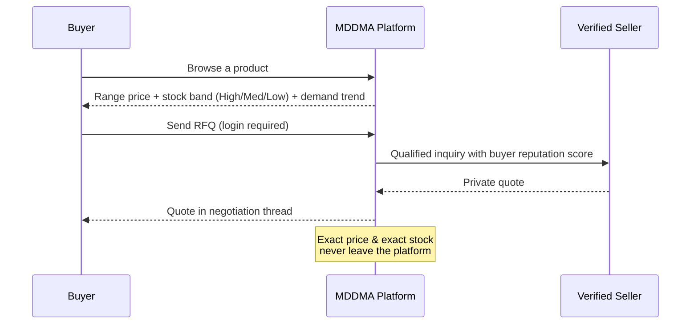

# Vision & Pitch

> **v3.1.3 Removal Notice (June 2026)** — The **RFQ engine, multi-item RFQ cart, `rfqs` / `inquiry_products` tables, /account/rfqs inbox, RFQ-related edge functions, and the /forms Verification Request** flow have all been **removed from the product**. Any section below that references RFQs, RFQ cart, RFQ inbox, `rfqs` / `inquiry_products`, or the /forms verification form is **historical only** and does not reflect the live app. The mobile bottom tab now opens the Member Dashboard from the Account tab, and Circulars / Members positions in the bottom tab bar have been swapped.

---

> **Thesis.** MDDMA does not expose the dry-fruits and dates market — it **structures and controls** it. The platform is a Behavioral Trade Operating System for the Mumbai Dry Fruits & Dates Merchants Association: a verified directory, a controlled-transparency catalogue, and a structured negotiation engine designed to keep pricing power inside the association.

> **Where this doc sits.** This is doc **01 of 17** — the start of the canonical reading order. Public spec runs **01 → 06**; owner-only deep reference runs **07 → 17**. Read in order on first pass; later, jump by topic. Authoritative invariants live in **11 · Decisions Log** — when narratives in earlier docs conflict with a decision entry, the decision entry wins.

> **Last verified** May 2026 against the live database (`public` schema), the four deployed edge functions, and `src/routes.tsx`.

## The problem

Mumbai's dry-fruits and dates trade runs on phone calls, WhatsApp screenshots, and broker memory. Three things are broken:

1. **Price leakage.** Public marketplaces broadcast exact prices and stock, eroding member margins and exposing the trade to price-shoppers.
2. **Trust asymmetry.** Buyers cannot tell a verified Association member from a stranger; sellers waste time on unqualified RFQs.
3. **Fragmented signals.** Demand spikes, festival cycles, port arrivals, and rate movements live in private chats — not in any single source the Association can govern.

## The solution — Controlled Transparency

MDDMA shows enough to enable trade, hides enough to preserve margin, and gates the rest behind verified membership.

The platform never shows exact prices or exact stock to anyone. Buyers see ranges and bands; sellers see qualified, reputation-scored inquiries; the Association sees the entire flow.

## Lean canvas

```mermaid
flowchart LR
  subgraph Problem
    P1[Price leakage]
    P2[Unverified buyers]
    P3[Signals trapped in chats]
  end
  subgraph Solution
    S1[Verified directory]
    S2[Controlled-transparency catalogue]
    S3[Structured RFQ engine]
    S4[Behavioral Intelligence Layer]
  end
  subgraph Channels
    C1[Association onboarding]
    C2[wa.me deeplinks]
    C3[Circulars + community forum]
  end
  subgraph Revenue
    R1[Free tier ₹0]
    R2[Paid member ₹10,000/yr]
    R3[Broker = is_broker flag · same fee, no addon]
  end
  Problem --> Solution --> Channels --> Revenue
```

| Block | Content |
|---|---|
| **Customer segments** | Verified Association members; institutional buyers; brokers |
| **Unfair advantage** | Association-controlled trust + behavioral signal layer no public marketplace can replicate |
| **Key metrics** | Verified members, qualified RFQs/month, RFQ→quote rate, buyer-reputation distribution |
| **Cost structure** | Hosting + Lovable Cloud, BIL API compute, light human moderation |

## ROI for the committee

A single typical lot saved from price-shopping recovers more than the annual paid-member fee. The break-even target is conservative: **40 paid members in year one** covers all platform costs and funds the BIL roadmap.

| Year | Paid members (incl. brokers) | Annual revenue at ₹10K/yr |
|---|---|---|
| 1 | 40 | ₹4.0 lakh |
| 2 | 120 | ₹12.0 lakh |
| 3 | 250 | ₹25.0 lakh |

Brokers are not a separate SKU — `profiles.is_broker = true` flips a flag on the same Paid membership and lists the member on `/broker`. (See decision **BIZ-003** in `11 · Decisions Log`.)

## What we are explicitly **not** building

- A public, price-comparison marketplace.
- A WhatsApp Business API integration (`wa.me` deeplinks only).
- Lead Packs or pay-per-lead monetisation (rejected — undermines membership value).
- Tiered Silver / Gold / Platinum plans (collapsed into one Paid tier for clarity).

These omissions are not gaps; they are the design.

> **Suite update (May 2026):** the documentation has grown from 6 to **28 docs** (6 public 01–06 + 22 internal 07–28). The new pack 18–28 adds the legal, operator, and pilot policies — Privacy, Terms, Refund, Grievance, KYC, SOW & SLA, Committee Guide, Retention, Pilot Plan, GTM playbook, and the Member-Data Migration plan.

## Read next

- **02 · Business & Scope** — what we sell and what's in the contract.
- **03 · Product & UX** — how members experience the platform.
- **19 · Privacy Policy** & **27 · Pilot Plan** — the new operator-facing essentials.
