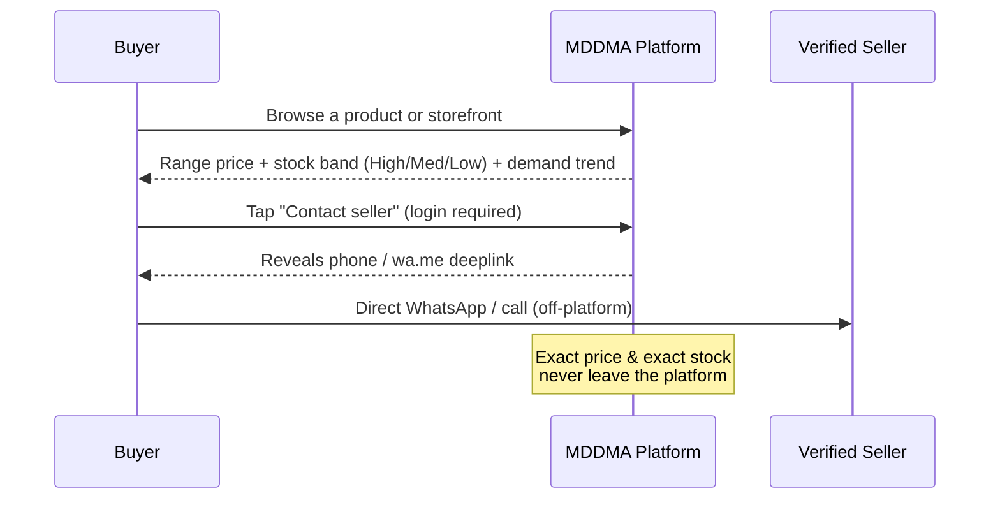

# Vision & Pitch

> **v3.2 Update Notice (July 2026)** — This doc has been updated for **v3.2**. Key changes since v3.1.3:
>
> - **RFQ is back**, under a new schema. The `/rfq` route is live, backed by the `rfq_listings` and `rfq_contact_reveals` tables. It is open to paid members and admins; contact reveal is logged. The old `rfqs` / `inquiry_products` / `rfq_responses` tables, the multi-item RFQ cart, `CartContext`, `CartFab` / `CartDrawer` / `RFQModal`, and the `/account/rfqs` inbox all remain **removed**. Any older reference below to those artifacts is historical.
> - **`/market` is now the Community Feed**, not Market News. It uses `community_posts`, `post_comments`, `post_likes`, `post_views`, and `anonymous_identity_log` (admin-only RLS). Paid + admin can post; free members are read-only for the first 7 days; guests see a teaser; anonymous posting is paid-only.
> - **Mobile bottom tab bar** order is now **Home (`/`) · Market (`/market`) · RFQ (`/rfq`) · Members (`/directory`) · Account (`/dashboard`)**.
> - **Admin Feature Access toggle** — while the pilot is running, admins can flip a global switch (`app_settings.features_open_to_all`, exposed via the `is_features_open()` SQL function) that temporarily opens Community Feed posts and RFQ listings to guests and free members. RLS on `community_posts` and `rfq_listings` reads `is_features_open()`; the frontend reads `featuresOpen` / `isEffectivePaid` from `RoleContext`. Managed from **Admin → Moderation → Feature Access**.
>
> The **/forms Verification Request** flow remains **removed** — members are verified during admin onboarding, not via a self-serve form.

---

> **Thesis.** MDDMA does not expose the dry-fruits and dates market — it **structures and controls** it. The platform is a Behavioral Trade Operating System for the Mumbai Dry Fruits & Dates Merchants Association: a verified directory, a controlled-transparency catalogue, seller storefronts and brands, and a published authority layer (knowledge, circulars, market news) designed to keep pricing power inside the association.

> **Where this doc sits.** This is doc **01 of 29** — the start of the canonical reading order. Public spec runs **00 → 06**; owner-only deep reference runs **07 → 28**. Read in order on first pass; later, jump by topic. Authoritative invariants live in **11 · Decisions Log** — when narratives in earlier docs conflict with a decision entry, the decision entry wins.

> **Last verified** June 2026 against the live database (`public` schema), the deployed edge functions, and `src/routes.tsx`.

## The problem

Mumbai's dry-fruits and dates trade runs on phone calls, WhatsApp screenshots, and broker memory. Three things are broken:

1. **Price leakage.** Public marketplaces broadcast exact prices and stock, eroding member margins and exposing the trade to price-shoppers.
2. **Trust asymmetry.** Buyers cannot tell a verified Association member from a stranger; sellers waste time on unqualified enquiries.
3. **Fragmented signals.** Demand spikes, festival cycles, port arrivals, and rate movements live in private chats — not in any single source the Association can govern.

## The solution — Controlled Transparency

MDDMA shows enough to enable trade, hides enough to preserve margin, and gates the rest behind verified membership.

The platform never shows exact prices or exact stock to anyone. Buyers see ranges and bands; sellers see verified contact requests; the Association sees the full directory, catalogue and content flow. Negotiations happen off-platform via `wa.me` deeplinks — there is **no in-app RFQ engine** (removed v3.1.3, see decision RFQ-001 in doc 11).

## Lean canvas

```mermaid
flowchart LR
  subgraph Problem
    P1[Price leakage]
    P2[Unverified buyers]
    P3[Signals trapped in chats]
  end
  subgraph Solution
    S1[Verified directory]
    S2[Controlled-transparency catalogue]
    S3[Storefronts + brands]
    S4[Authority layer: knowledge, circulars, market news]
    S5[Behavioral Intelligence Layer]
  end
  subgraph Channels
    C1[Association onboarding]
    C2[wa.me deeplinks]
    C3[Circulars + community forum]
  end
  subgraph Revenue
    R1[Free tier ₹0]
    R2[Paid member ₹10,000/yr]
    R3[Broker = is_broker flag · same fee, no addon]
  end
  Problem --> Solution --> Channels --> Revenue
```

| Block | Content |
|---|---|
| **Customer segments** | Verified Association members; institutional buyers; brokers |
| **Unfair advantage** | Association-controlled trust + behavioral signal layer no public marketplace can replicate |
| **Key metrics** | Verified members, contact reveals/month, storefront views, circular reach, buyer-reputation distribution |
| **Cost structure** | Hosting + Lovable Cloud, BIL API compute, light human moderation |

## ROI for the committee

A single typical lot saved from price-shopping recovers more than the annual paid-member fee. The break-even target is conservative: **40 paid members in year one** covers all platform costs and funds the BIL roadmap.

| Year | Paid members (incl. brokers) | Annual revenue at ₹10K/yr |
|---|---|---|
| 1 | 40 | ₹4.0 lakh |
| 2 | 120 | ₹12.0 lakh |
| 3 | 250 | ₹25.0 lakh |

Brokers are not a separate SKU — `profiles.is_broker = true` flips a flag on the same Paid membership and lists the member on `/broker`. (See decision **BIZ-003** in `11 · Decisions Log`.)

## What we are explicitly **not** building

- A public, price-comparison marketplace.
- An in-app RFQ / multi-item cart engine (removed v3.1.3).
- A WhatsApp Business API integration (`wa.me` deeplinks only).
- Lead Packs or pay-per-lead monetisation (rejected — undermines membership value).
- Tiered Silver / Gold / Platinum plans (collapsed into one Paid tier for clarity).
- Native mobile apps (PWA covers the use case).

These omissions are not gaps; they are the design.

> **Suite update (June 2026):** the documentation runs to **29 docs** — 7 public (00–06, including the Start Here orientation) and 22 internal (07–28). The pack 18–28 covers the legal, operator, and pilot policies — Privacy, Terms, Refund, Grievance, KYC, SOW & SLA, Committee Guide, Retention, Pilot Plan, GTM playbook, and the Member-Data Migration plan.

## Read next

- **02 · Business & Scope** — what we sell and what's in the contract.
- **03 · Product & UX** — how members experience the platform.
- **19 · Privacy Policy** & **27 · Pilot Plan** — the new operator-facing essentials.
