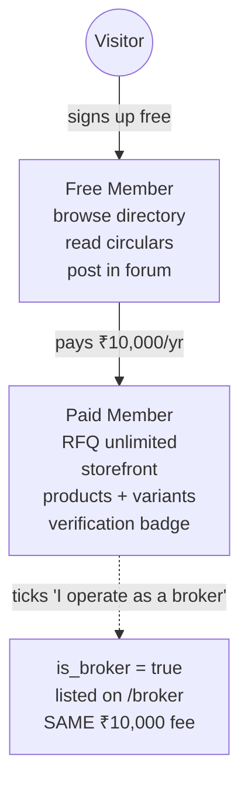
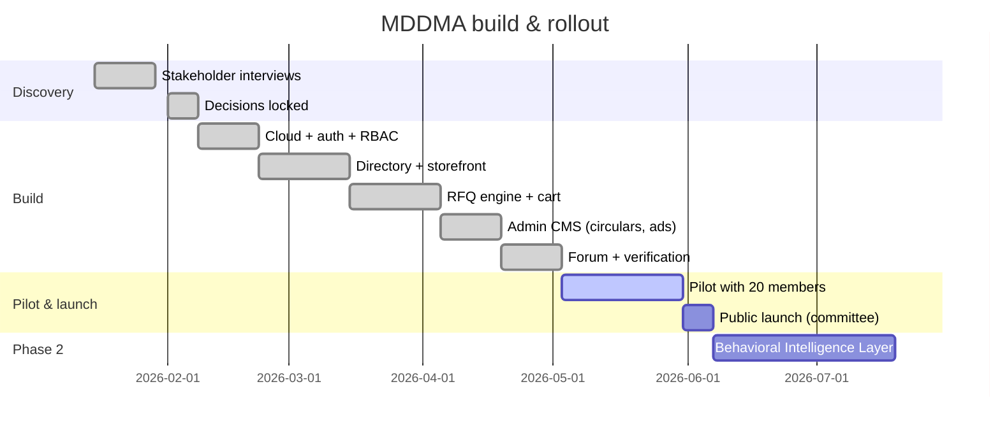

# Business & Scope

This document defines **what the platform is for the Association as a business**: strategic goals, monetisation, the engagement scope, and the boundaries we deliberately enforce.

## Strategic goals

1. **Concentrate trust** inside the Association by making "verified MDDMA member" the only badge that matters in the trade.
2. **Protect pricing power** by suppressing exact-price discovery on the public web.
3. **Capture signal** — every RFQ, quote, and search becomes a data point the Association governs.
4. **Move negotiations off WhatsApp** into a structured, auditable RFQ thread.

## Monetisation — one tier, one flag

The earlier multi-tier ladder (Silver / Gold / Platinum) is killed. It created decision fatigue with no revenue lift. The model is now binary plus an optional broker flag — **same price either way**.

| Tier | Annual fee | What's included |
|---|---|---|
| Free | ₹0 | Browse directory, read circulars, view & post in community forum |
| Paid | ₹10,000 | All Free + send/receive RFQs, public storefront, product catalogue with variants, verification badge, full contact reveal |
| Broker | ₹10,000 | A Paid Member with `profiles.is_broker = true`. Listed on `/broker`. **No separate fee** (BIZ-003). |

**Lead Packs are not part of the product** and never will be (BIZ-001). Selling buyer-attention by the unit conflicts with the Association's role as a trust authority.

## Engagement scope (Statement of Work)

### Deliverables

- A production web app at the Association's domain, installable as a PWA.
- Admin CMS for circulars, ads, and member moderation.
- Verified-member onboarding flow with KYC document upload.
- RFQ engine with multi-item cart, drafts, and quote thread.
- Native community forum (posts + comments).
- Documentation suite (this set of 6 documents) maintained in source control.

### Milestones & payments

| # | Milestone | Trigger | Share |
|---|---|---|---|
| M1 | Cloud + auth + role simulator live | Demo accepted | 25% |
| M2 | Directory + storefronts + RFQ cart | Pilot kickoff | 35% |
| M3 | CMS + forum + verification | Public launch | 25% |
| M4 | BIL phase-2 contract & first signal endpoint | Signed off by committee | 15% |

### Ways of working

- Source of truth: this `/documents` suite, versioned in git.
- Decisions are recorded directly in the relevant doc — no parallel "change log" overlay.
- Weekly written update during build; bi-weekly committee review during pilot.
- All credentials and infrastructure under the Association's account.

## What's **out of scope**

| Out of scope | Why |
|---|---|
| Public price comparison | Violates controlled-transparency thesis |
| WhatsApp Business API | Cost + compliance overhead; `wa.me` deeplinks suffice |
| Lead Packs / pay-per-lead | Conflicts with membership trust model |
| Multi-tier paid plans | Decision fatigue; no observed revenue lift |
| Native mobile apps | PWA install covers the use case |
| In-platform escrow | Trade settlement stays bank-to-bank |

## Read next

- **03 · Product & UX** — who the users are and how they experience this.
- **06 · Build & Operations** — how we ship and maintain it.
