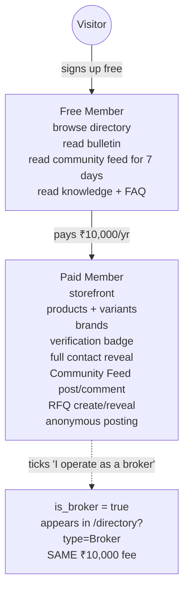
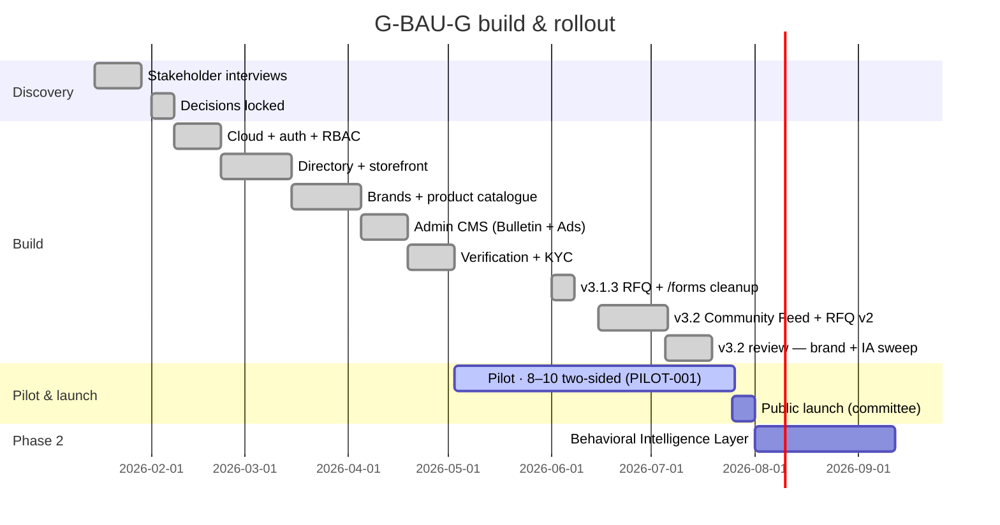

# Business & Scope

> **v3.2 · Last verified July 2026** against the live app shell, database and routes.

This document defines **what the platform is for the Association as a business**: strategic goals, monetisation, engagement scope, and the boundaries we deliberately enforce.

## Strategic goals

1. **Concentrate trust** inside the Association by making "verified MDDMA member" the only badge that matters in the trade.
2. **Protect pricing power** by suppressing exact-price discovery on the public web.
3. **Capture signal** — every directory view, storefront visit, contact-reveal, RFQ listing, community post, and bulletin read becomes a data point the Association governs.
4. **Move discovery off WhatsApp** into a searchable, auditable directory + storefront + community surface, while keeping negotiation itself on `wa.me`.

## Monetisation — one tier, one flag

The earlier multi-tier ladder (Silver / Gold / Platinum) is killed. It created decision fatigue with no revenue lift. The model is binary plus an optional broker flag — **same price either way**.

| Tier | Annual fee | What's included |
|---|---|---|
| Free | ₹0 | Browse directory, read Bulletin, read Community Feed (7-day window), read Knowledge + FAQ |
| Paid | ₹10,000 | All Free + public storefront, product catalogue with variants, brand pages, verification badge, full contact reveal, Community Feed post/comment/like/poll/anon, RFQ create + contact reveal |
| Broker | ₹10,000 | A Paid Member with `profiles.is_broker = true`. Appears in `/directory?type=Broker`. **No separate fee** (BIZ-003) |

**Lead Packs are not part of the product** and never will be (BIZ-001). Selling buyer-attention by the unit conflicts with the Association's role as a trust authority.

### Pilot-window override

While the pilot is live, admins can flip a global **Feature Access** switch (`app_settings.features_open_to_all`) from **Admin → Moderation → Feature Access**. When on, RLS on `community_posts` and `rfq_listings` opens reads to guests and free members via the `is_features_open()` SQL helper, and `RoleContext.isEffectivePaid` becomes true across the frontend. Toggling it off returns instantly to the tier gates above.

## Engagement scope (Statement of Work)

### Deliverables

- Production web app at the Association's domain, installable as a PWA, branded **G-BAU-G by Mumbai Dryfruits & Dates Merchants Association**.
- Admin CMS for **Bulletin** (circulars), Ads, and member moderation, plus the **Feature Access** toggle.
- Verified-member onboarding with KYC document upload, reviewed by an admin.
- Member directory, seller storefronts (`/store/:slug`), brand pages (`/brands/:slug`) and a cross-member product catalogue.
- **Community Feed** (`/market`) with images/PDFs/polls/anonymous mode/pinned rate cards/oEmbed previews.
- **RFQ board** (`/rfq`) with 1–90 day expiry and logged contact reveal.
- **Public authority pages** — `/`, `/about`, `/membership`, `/apply`, `/install`, `/circulars`, `/knowledge`, `/knowledge/:slug`, `/faq` (FAQPage JSON-LD), `/contact`.
- Forms surface (Advertise + Submit Circular) at `/forms`.
- Dashboard with 5-step OnboardingChecklist and dismissible InstallAppNudge.
- Documentation suite — **29 docs** (7 public 00–06 + 22 internal 07–28), versioned in source control.

### Legal, policy & operator pack (shipped May 2026)

| # | Doc | Why it exists |
|---|---|---|
| 18 | Member Data Audit & Migration | 350+ legacy members move in with consent and dedupe |
| 19 | Privacy Policy | DPDP Act 2023 + IT Rules 2021 compliance |
| 20 | Terms of Service | Account, listing, payment, liability terms |
| 21 | Refund & Cancellation | Required by Razorpay; cooling-off + pro-rata rules |
| 22 | Grievance & Redressal | Named officer + IT Rules timelines |
| 23 | KYC & Verification Policy | The "what / how long / who can see" behind the tier ladder |
| 24 | SOW & Maintenance SLA | Build + maintenance scope, severity SLAs, IP |
| 25 | Committee Operator Guide | Zero-SQL guide for office staff |
| 26 | Data Retention & Deletion | Anonymisation + erasure workflow |
| 27 | Pilot Plan & Success Criteria | 90-day cohort, must-hit metrics, decision rule |
| 28 | GTM & Onboarding Playbook | Pattern D execution, anchor scripts, founding window |

### Milestones & payments

| # | Milestone | Trigger | Share |
|---|---|---|---|
| M1 | Cloud + auth + role simulator live | Demo accepted | 25% |
| M2 | Directory + storefronts + brands + catalogue | Pilot kickoff | 35% |
| M3 | CMS + verification + Community Feed + RFQ | Public launch | 25% |
| M4 | BIL phase-2 contract & first signal endpoint | Signed off by committee | 15% |
| M5 | Legal & operator doc pack (18–28) | Counsel review + committee sign-off | included in maintenance |

### Ways of working

- Source of truth: this `/documents` suite, versioned in git.
- Decisions are recorded directly in the relevant doc — no parallel "change log" overlay.
- Weekly written update during build; bi-weekly committee review during pilot.
- All credentials and infrastructure under the Association's account.

## What's **out of scope**

| Out of scope | Why |
|---|---|
| Public price comparison | Violates controlled-transparency thesis |
| Multi-item RFQ cart / in-app negotiation engine | Wa.me is the negotiation surface; RFQ board is single-listing intent only |
| WhatsApp Business API | Cost + compliance overhead; `wa.me` deeplinks suffice |
| Lead Packs / pay-per-lead | Conflicts with membership trust model |
| Multi-tier paid plans | Decision fatigue; no observed revenue lift |
| Native mobile apps | PWA install covers the use case |
| In-platform escrow / payments between members | Trade settlement stays bank-to-bank |
| Self-serve /forms Verification Request | Verification is admin-driven only (removed v3.1.3) |

## Read next

- **03 · Product & UX** — who the users are and how they experience this.
- **06 · Build & Operations** — how we ship and maintain it.
