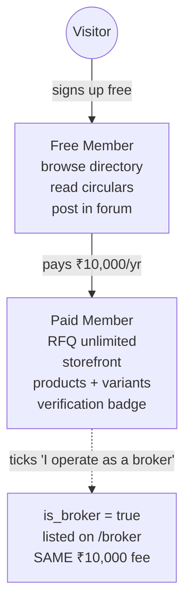
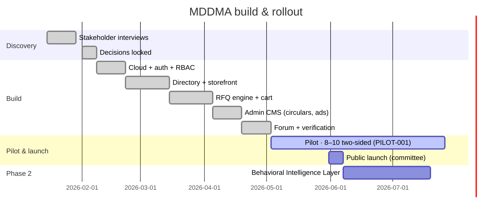

# Business & Scope

> **v3.1.3 Removal Notice (June 2026)** — The **RFQ engine, multi-item RFQ cart, `rfqs` / `inquiry_products` tables, /account/rfqs inbox, RFQ-related edge functions, and the /forms Verification Request** flow have all been **removed from the product**. Any section below that references RFQs, RFQ cart, RFQ inbox, `rfqs` / `inquiry_products`, or the /forms verification form is **historical only** and does not reflect the live app. The mobile bottom tab now opens the Member Dashboard from the Account tab, and Circulars / Members positions in the bottom tab bar have been swapped.

---

This document defines **what the platform is for the Association as a business**: strategic goals, monetisation, the engagement scope, and the boundaries we deliberately enforce.

## Strategic goals

1. **Concentrate trust** inside the Association by making "verified MDDMA member" the only badge that matters in the trade.
2. **Protect pricing power** by suppressing exact-price discovery on the public web.
3. **Capture signal** — every RFQ, quote, and search becomes a data point the Association governs.
4. **Move negotiations off WhatsApp** into a structured, auditable RFQ thread.

## Monetisation — one tier, one flag

The earlier multi-tier ladder (Silver / Gold / Platinum) is killed. It created decision fatigue with no revenue lift. The model is now binary plus an optional broker flag — **same price either way**.

| Tier | Annual fee | What's included |
|---|---|---|
| Free | ₹0 | Browse directory, read circulars, view & post in community forum |
| Paid | ₹10,000 | All Free + send/receive RFQs, public storefront, product catalogue with variants, verification badge, full contact reveal |
| Broker | ₹10,000 | A Paid Member with `profiles.is_broker = true`. Listed on `/broker`. **No separate fee** (BIZ-003). |

**Lead Packs are not part of the product** and never will be (BIZ-001). Selling buyer-attention by the unit conflicts with the Association's role as a trust authority.

## Engagement scope (Statement of Work)

### Deliverables

- A production web app at the Association's domain, installable as a PWA.
- Admin CMS for circulars, ads, and member moderation.
- Verified-member onboarding flow with KYC document upload.
- RFQ engine with multi-item cart, drafts, and quote thread.
- Native community forum (posts + comments).
- Documentation suite — **28 docs as of May 2026** (6 public 01–06 + 22 internal 07–28), versioned in source control. The pack 18–28 covers the legal, policy and operator essentials below.

### Legal, policy & operator pack (shipped May 2026)

| # | Doc | Why it exists |
|---|---|---|
| 18 | Member Data Audit & Migration | 350+ legacy members move in with consent and dedupe |
| 19 | Privacy Policy | DPDP Act 2023 + IT Rules 2021 compliance |
| 20 | Terms of Service | Account, listing, RFQ, payment, liability terms |
| 21 | Refund & Cancellation | Required by Razorpay; cooling-off + pro-rata rules |
| 22 | Grievance & Redressal | Named officer + IT Rules timelines |
| 23 | KYC & Verification Policy | The "what / how long / who can see" behind the tier ladder |
| 24 | SOW & Maintenance SLA | Build + maintenance scope, severity SLAs, IP |
| 25 | Committee Operator Guide | Zero-SQL guide for office staff |
| 26 | Data Retention & Deletion | RFQ snapshot anonymisation + erasure workflow |
| 27 | Pilot Plan & Success Criteria | 90-day cohort, must-hit metrics, decision rule |
| 28 | GTM & Onboarding Playbook | Pattern D execution, anchor scripts, founding window |

### Milestones & payments

| # | Milestone | Trigger | Share |
|---|---|---|---|
| M1 | Cloud + auth + role simulator live | Demo accepted | 25% |
| M2 | Directory + storefronts + RFQ cart | Pilot kickoff | 35% |
| M3 | CMS + forum + verification | Public launch | 25% |
| M4 | BIL phase-2 contract & first signal endpoint | Signed off by committee | 15% |
| M5 | Legal & operator doc pack (18–28) | Counsel review + committee sign-off | included in maintenance |

### Ways of working

- Source of truth: this `/documents` suite, versioned in git.
- Decisions are recorded directly in the relevant doc — no parallel "change log" overlay.
- Weekly written update during build; bi-weekly committee review during pilot.
- All credentials and infrastructure under the Association's account.

## What's **out of scope**

| Out of scope | Why |
|---|---|
| Public price comparison | Violates controlled-transparency thesis |
| WhatsApp Business API | Cost + compliance overhead; `wa.me` deeplinks suffice |
| Lead Packs / pay-per-lead | Conflicts with membership trust model |
| Multi-tier paid plans | Decision fatigue; no observed revenue lift |
| Native mobile apps | PWA install covers the use case |
| In-platform escrow | Trade settlement stays bank-to-bank |

## Read next

- **03 · Product & UX** — who the users are and how they experience this.
- **06 · Build & Operations** — how we ship and maintain it.
