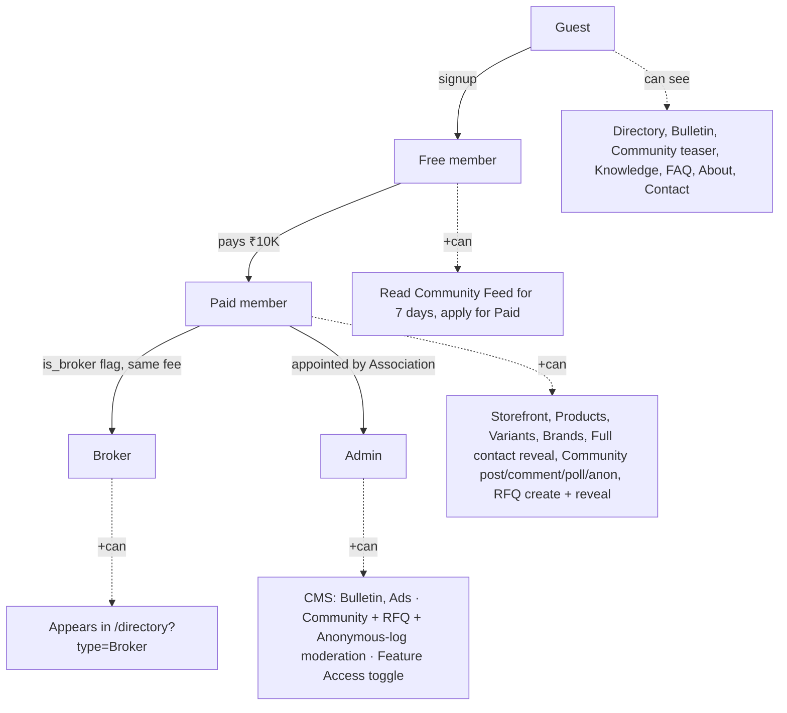
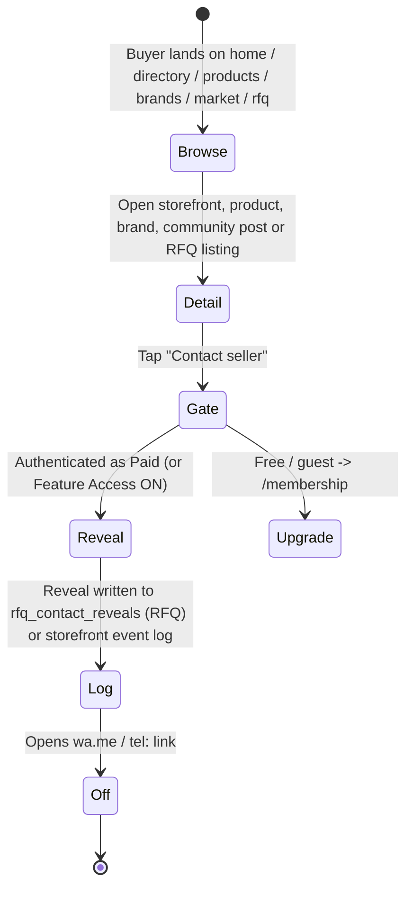

# Product & UX

> **v3.2 · Last verified July 2026** against the live app shell (`Header`, `Footer`, `MobileBottomTabBar`), routes, and role-context flags.

How real members experience G-BAU-G — personas, what each role can see, the controlled-transparency rules that govern every screen, and how a buyer moves from discovery to contact.

## Personas

| Persona | Role enum | Primary goal |
|---|---|---|
| **Trader Buyer** | `paid_member` | Source verified supply at fair ranges; negotiate via WhatsApp |
| **Trader Seller** | `paid_member` | Get discovered in directory, storefront and brand pages; protect price discovery |
| **Broker** | `broker` (paid + `is_broker`) | Match supply and demand across members |
| **Visitor / Free member** | `free_member` | Establish trust before paying; browse directory, bulletin, community feed teaser |
| **Association admin** | `admin` | Verify members, publish bulletin, moderate community, run RFQ moderation, manage ads, flip Feature Access |

A header **role simulator** lets the committee experience the site as any role during demos and reviews.

## Navigation shell

| Surface | Contents |
|---|---|
| **Header (desktop)** | Logo (G.BAU.G · "by Mumbai Dryfruits & Dates Merchants Association") · **Home · Directory · Products · Market · RFQ · Membership · More** (Brands, Circulars, Knowledge, FAQ, About, Contact) · Role simulator · Auth |
| **Header (mobile)** | Logo · Auth · Role simulator drawer |
| **Bottom tabs (mobile only)** | Home (`/`) · Market (`/market`) · RFQ (`/rfq`) · Members (`/directory`) · Account (`/dashboard`) — 52 px hit area, `text-[11px]` labels |
| **Footer** | Brand block · Explore · Members · **Legal** · Contact block |
| **Retired routes (v3.2 review)** | `/broker` → `/directory?type=Broker` · `/community` → `/market` · `/directorylist` → `/directory` · `/contact` is now a real page (was a Forms alias) |

## Home shell

`/` renders, in order: **HomeHero** (proof points + guest-vs-member CTAs) → Homepage banner ad → **LiveTicker** (auto-scrolling APMC rate signals) → **QuickActionsGrid** (4 primary tiles with live counts for Bulletin and RFQ) → **CategoryGrid** (two horizontal snap-strips: 4 tiles on mobile, 8 on desktop, featured first) → interstitial ad → **New Products** (`RecentListingsList`) → **New Members** (`NewMembersList`) → **Membership CTA**. The removed "Our partners" and "PAID member" strips are not coming back.

## Dashboard shell

`/dashboard` (opened by the "Account" bottom tab) shows the hero card (gold underline), the **OnboardingChecklist** (5 steps, live progress from Supabase: profile → company → verification → first product → first community post), and the dismissible **InstallAppNudge** (dismiss state stored in `localStorage.mddma:install-nudge-dismissed`). From there members reach `/account/profile`, `/account/company`, `/account/products`, `/account/brands`, and (admin only) `/account/moderation`.

## Role-based access

| Capability | Guest | Free | Paid | Broker | Admin |
|---|:-:|:-:|:-:|:-:|:-:|
| Browse directory | ✓ | ✓ | ✓ | ✓ | ✓ |
| See full member contact / wa.me reveal | — | — | ✓ | ✓ | ✓ |
| Read Community Feed | teaser | ✓ (7 d) | ✓ | ✓ | ✓ |
| Post / comment / like / poll in Community Feed | — | — | ✓ | ✓ | ✓ |
| Anonymous posting | — | — | ✓ | ✓ | ✓ |
| Read RFQ listings | teaser | teaser | ✓ | ✓ | ✓ |
| Create RFQ listing | — | — | ✓ | ✓ | ✓ |
| Reveal RFQ contact | — | — | ✓ | ✓ | ✓ |
| Storefront + products + brands | — | — | ✓ | ✓ | ✓ |
| Appear in `/directory?type=Broker` | — | — | — | ✓ | — |
| Publish Bulletin / ads | — | — | — | — | ✓ |
| Verify members / see anonymous-post log | — | — | — | — | ✓ |
| Flip Feature Access toggle | — | — | — | — | ✓ |

When Feature Access is **on** during the pilot, the two "teaser" rows above open fully to guests and free members via RLS (`is_features_open()`) and `isEffectivePaid` in `RoleContext`.

## The controlled-transparency rules

These rules are non-negotiable and enforced in components, not policy:

1. **Never render an exact price.** Use a range (₹X–₹Y per kg) computed from the seller's input.
2. **Never render an exact stock figure.** Use bands: **High**, **Medium**, **Low**.
3. **Always render a demand trend** (rising / steady / cooling) instead of raw search counts.
4. **No public price comparison view.** Search and filter never sort by exact price.
5. **Contact details are gated.** Phone / WhatsApp deeplink reveal requires Paid status (or Feature Access ON), and every RFQ reveal is written to `rfq_contact_reveals`.

`<GuardedPrice>`, `<PriceBand>`, `<StockBand>` and the trend chips are the single point of enforcement — UI cannot accidentally leak raw values.

## Discovery → Contact flow

Negotiations happen off-platform. The journey ends in a `wa.me` deeplink or a revealed phone number.

## Buyer reputation, not seller reputation

Public marketplaces rate sellers and let buyers hide. G-BAU-G inverts this:

- **Buyers will carry a reputation score** (planned, GOV-001) visible to sellers reviewing inbound enquiries and RFQ interest.
- Sellers' reputations are implicit in their verified-member status — that's what the Association badge means.
- This shifts power back to suppliers and discourages price-shoppers.

## Verification & badges

A **Verified** badge appears next to a member when KYC documents (GST, business registration, identity) have been reviewed and approved by an admin via `/account/moderation`. Verification is a one-time gate, not a recurring re-check, and the badge is the single visual proof of trust on the platform. The badge uses the `success` semantic token — hard-coded emerald/green utilities are forbidden. The **/forms Verification Request** flow has been removed (v3.1.3) — members are verified during admin onboarding. Full policy in **doc 23**.

## Community Feed compose behavior

The `/market` compose sheet mirrors a Twitter-style card with avatar, borderless textarea and a row of pill actions: **Photo · File · Link · Poll · Signal**. Photos support clipboard paste; files are PDFs; links auto-expand into rich cards (image + title + description, video play overlay for YouTube/Vimeo via oEmbed, dedicated file chip for direct PDFs); polls are backed by `post_polls` / `post_poll_options` / `post_poll_votes`; the anonymous toggle shows an inline compliance-log explainer ("your real identity is logged for admin audit"). The floating **Post** button sits at `z-50` with `bottom-24` so it clears the mobile bottom tabs.

## Member-facing policies

Privacy Policy (doc 19), Terms of Service (doc 20), Refund & Cancellation (doc 21) and the Grievance & Redressal mechanism (doc 22) are first-class member-facing documents. **Aditya Parmar** is the named Grievance & Data Protection Officer; their contact appears on `/contact`, in the footer's Legal column, and on the relevant policies once promoted to public routes.

## Read next

- **04 · Functional Spec** — module-by-module specification.
- **05 · Architecture & Tech** — how these rules are enforced in code.
