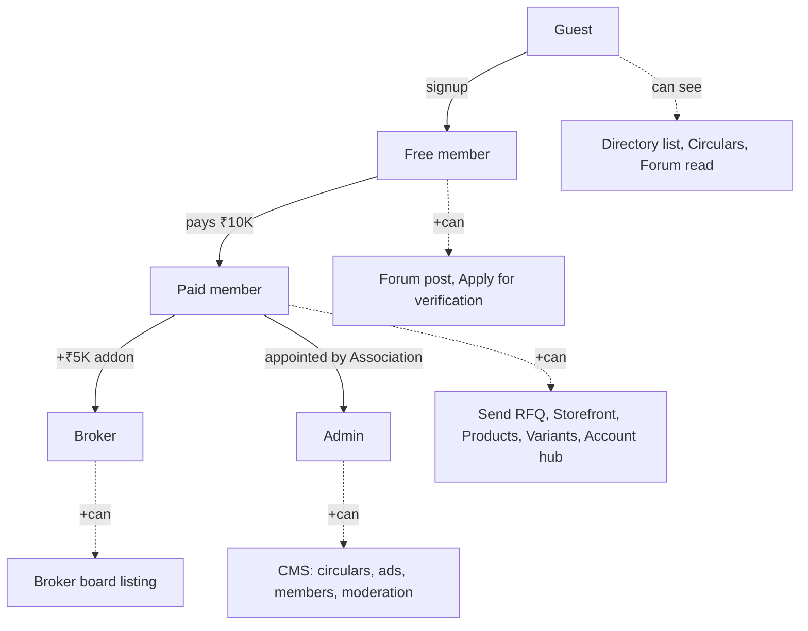
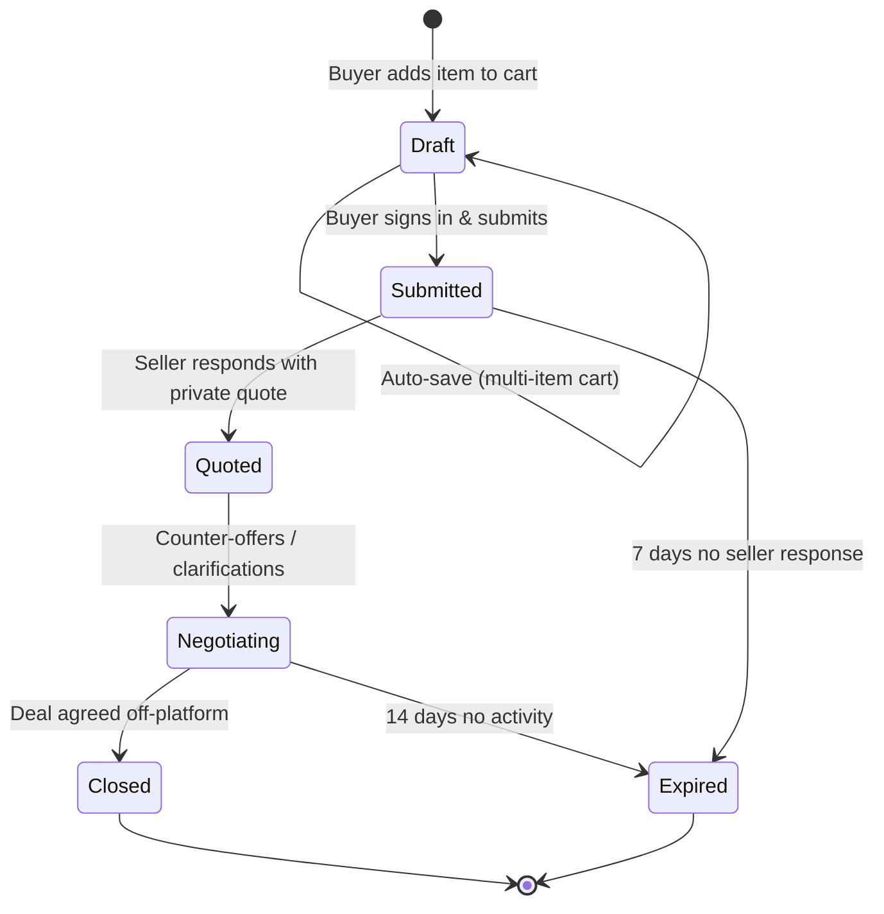

# Product & UX

How real members experience MDDMA — personas, what each role can see, the controlled-transparency rules that govern every screen, and how an RFQ moves from intent to negotiation.

## Personas

| Persona | Role enum | Primary goal |
|---|---|---|
| **Trader Buyer** | `paid_member` | Source verified supply at fair ranges; negotiate in private |
| **Trader Seller** | `paid_member` | Receive qualified RFQs; protect price discovery |
| **Broker** | `broker` (paid + `is_broker`) | Match supply and demand across members |
| **Visitor / Free member** | `free_member` | Establish trust before paying; browse circulars and directory |
| **Association admin** | `admin` | Verify members, publish circulars, moderate forum, manage ads |

A header **role simulator** lets the committee experience the site as any role during demos and reviews.

## Role-based access

| Capability | Guest | Free | Paid | Broker | Admin |
|---|:-:|:-:|:-:|:-:|:-:|
| Browse directory | ✓ | ✓ | ✓ | ✓ | ✓ |
| See full member contact | — | — | ✓ | ✓ | ✓ |
| Read forum | ✓ | ✓ | ✓ | ✓ | ✓ |
| Post in forum | — | ✓ | ✓ | ✓ | ✓ |
| Send RFQ | — | — | ✓ | ✓ | ✓ |
| Storefront + products | — | — | ✓ | ✓ | ✓ |
| Listed on Broker board | — | — | — | ✓ | — |
| Publish circulars / ads | — | — | — | — | ✓ |
| Verify members | — | — | — | — | ✓ |

## The controlled-transparency rules

These rules are non-negotiable and enforced in components, not policy:

1. **Never render an exact price.** Use a range (₹X–₹Y per kg) computed from the seller's input.
2. **Never render an exact stock figure.** Use bands: **High**, **Medium**, **Low**.
3. **Always render a demand trend** (rising / steady / cooling) instead of raw search counts.
4. **No public price comparison view.** Search and filter never sort by exact price.
5. **Contact details are gated.** Phone / WhatsApp deeplink reveal requires Paid status.

The `<GuardedPrice>` and stock-band components are the single point of enforcement — UI cannot accidentally leak raw values.

## RFQ lifecycle

RFQs are the platform's core artifact. They are **persistent database entities**, not emails. Sending one **requires authentication** — anonymous RFQs are rejected because reputation-without-identity is meaningless.

Drafts auto-save so a buyer can build a multi-item RFQ across browsing sessions. The cart FAB and drawer are global UI.

## Buyer reputation, not seller reputation

Public marketplaces rate sellers and let buyers hide. MDDMA inverts this:

- **Buyers carry a reputation score** visible to sellers reviewing inbound RFQs.
- Sellers' reputations are implicit in their verified-member status — that's what the Association badge means.
- This shifts power back to suppliers and discourages price-shoppers from polluting the RFQ inbox.

## Verification & badges

A **Verified** badge appears next to a member when KYC documents (GST, business registration, identity) have been reviewed and approved by an admin. Verification is a one-time gate, not a recurring re-check, and the badge is the single visual proof of trust on the platform.

## Read next

- **04 · Functional Spec** — module-by-module specification.
- **05 · Architecture & Tech** — how these rules are enforced in code.
