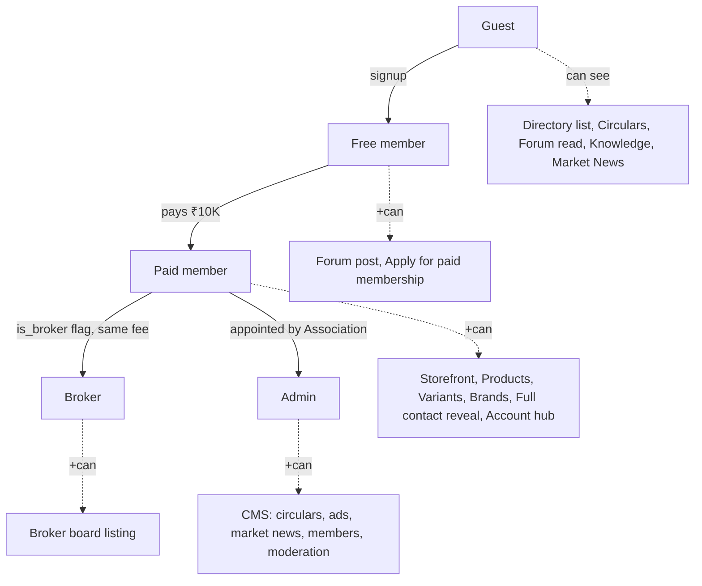
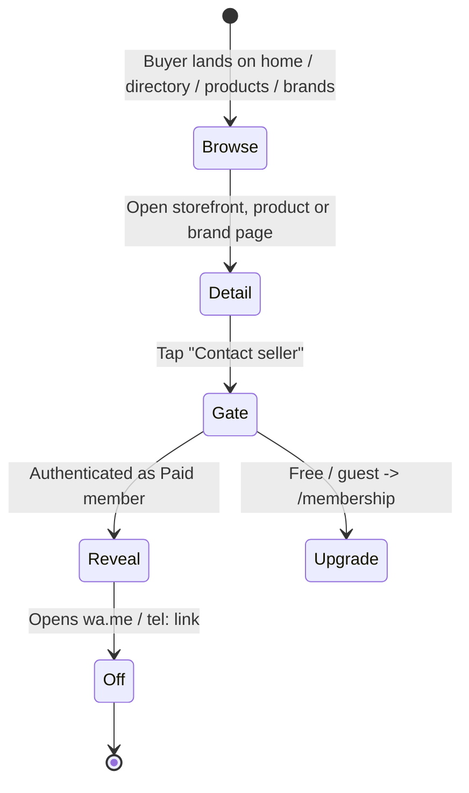

# Product & UX

> **v3.1.3 Removal Notice (June 2026)** — The **RFQ engine, multi-item RFQ cart, `rfqs` / `inquiry_products` tables, /account/rfqs inbox, RFQ-related edge functions, and the /forms Verification Request** flow have all been **removed from the product**. Any section below that references RFQs, RFQ cart, RFQ inbox, `rfqs` / `inquiry_products`, or the /forms verification form is **historical only** and does not reflect the live app. The mobile bottom tab now opens the Member Dashboard from the Account tab, and Circulars / Members positions in the bottom tab bar have been swapped.

---

How real members experience MDDMA — personas, what each role can see, the controlled-transparency rules that govern every screen, and how a buyer moves from discovery to contact.

## Personas

| Persona | Role enum | Primary goal |
|---|---|---|
| **Trader Buyer** | `paid_member` | Source verified supply at fair ranges; negotiate via WhatsApp |
| **Trader Seller** | `paid_member` | Get discovered in directory, storefront and brand pages; protect price discovery |
| **Broker** | `broker` (paid + `is_broker`) | Match supply and demand across members |
| **Visitor / Free member** | `free_member` | Establish trust before paying; browse circulars and directory |
| **Association admin** | `admin` | Verify members, publish circulars and market news, moderate forum, manage ads |

A header **role simulator** lets the committee experience the site as any role during demos and reviews.

## Home shell

The home page (`/`) stacks: Homepage banner ad → Today header → Live Rates Ticker → Quick Actions → Category Grid → **New Products** (recent listings) → **New Members** → Membership CTA → Partners Strip. The bottom mobile tab bar order is **Today · Brands · Circulars · Members · Account**, where Account opens `/dashboard`.

## Role-based access

| Capability | Guest | Free | Paid | Broker | Admin |
|---|:-:|:-:|:-:|:-:|:-:|
| Browse directory | ✓ | ✓ | ✓ | ✓ | ✓ |
| See full member contact / wa.me reveal | — | — | ✓ | ✓ | ✓ |
| Read forum / knowledge / market news | ✓ | ✓ | ✓ | ✓ | ✓ |
| Post in forum | — | ✓ | ✓ | ✓ | ✓ |
| Storefront + products + brands | — | — | ✓ | ✓ | ✓ |
| Listed on Broker board | — | — | — | ✓ | — |
| Publish circulars / ads / market news | — | — | — | — | ✓ |
| Verify members | — | — | — | — | ✓ |

## The controlled-transparency rules

These rules are non-negotiable and enforced in components, not policy:

1. **Never render an exact price.** Use a range (₹X–₹Y per kg) computed from the seller's input.
2. **Never render an exact stock figure.** Use bands: **High**, **Medium**, **Low**.
3. **Always render a demand trend** (rising / steady / cooling) instead of raw search counts.
4. **No public price comparison view.** Search and filter never sort by exact price.
5. **Contact details are gated.** Phone / WhatsApp deeplink reveal requires Paid status.

The `<GuardedPrice>` and stock-band components are the single point of enforcement — UI cannot accidentally leak raw values.

## Discovery → Contact flow

Negotiations happen off-platform. The journey ends in a `wa.me` deeplink or a revealed phone number — there is no in-app RFQ, cart, or inbox (RFQ-001 removed v3.1.3).

## Buyer reputation, not seller reputation

Public marketplaces rate sellers and let buyers hide. MDDMA inverts this:

- **Buyers will carry a reputation score** (planned, GOV-001) visible to sellers reviewing inbound enquiries.
- Sellers' reputations are implicit in their verified-member status — that's what the Association badge means.
- This shifts power back to suppliers and discourages price-shoppers.

## Verification & badges

A **Verified** badge appears next to a member when KYC documents (GST, business registration, identity) have been reviewed and approved by an admin via `/account/moderation`. Verification is a one-time gate, not a recurring re-check, and the badge is the single visual proof of trust on the platform. The **/forms Verification Request** flow has been removed (v3.1.3) — members are verified during admin onboarding, not via a self-serve form. The full policy lives in **doc 23 (KYC & Verification Policy)**.

## Member-facing policies

Privacy Policy (doc 19), Terms of Service (doc 20), Refund & Cancellation (doc 21) and the Grievance & Redressal mechanism (doc 22) are first-class member-facing documents. **Aditya Parmar** is the named Grievance & Data Protection Officer; their contact appears on the relevant pages and in the footer once the policies are promoted to public routes.

## Read next

- **04 · Functional Spec** — module-by-module specification.
- **05 · Architecture & Tech** — how these rules are enforced in code.
