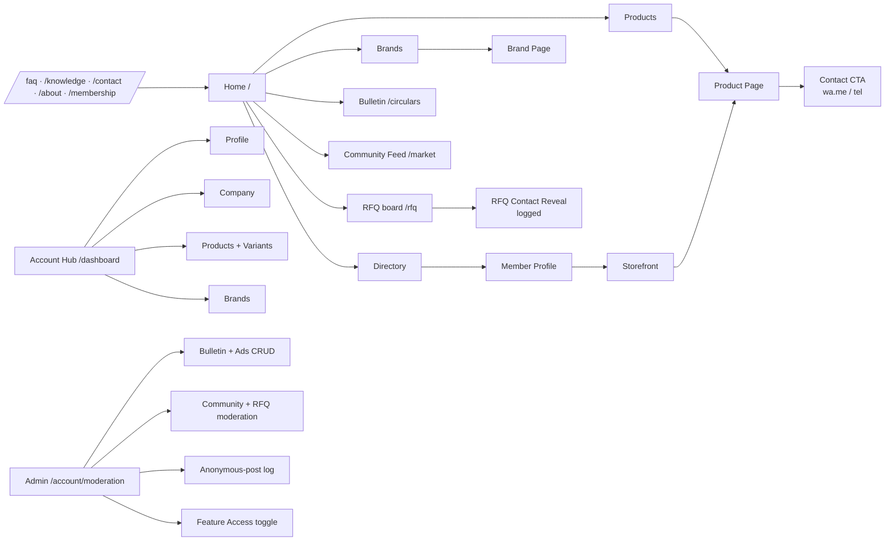
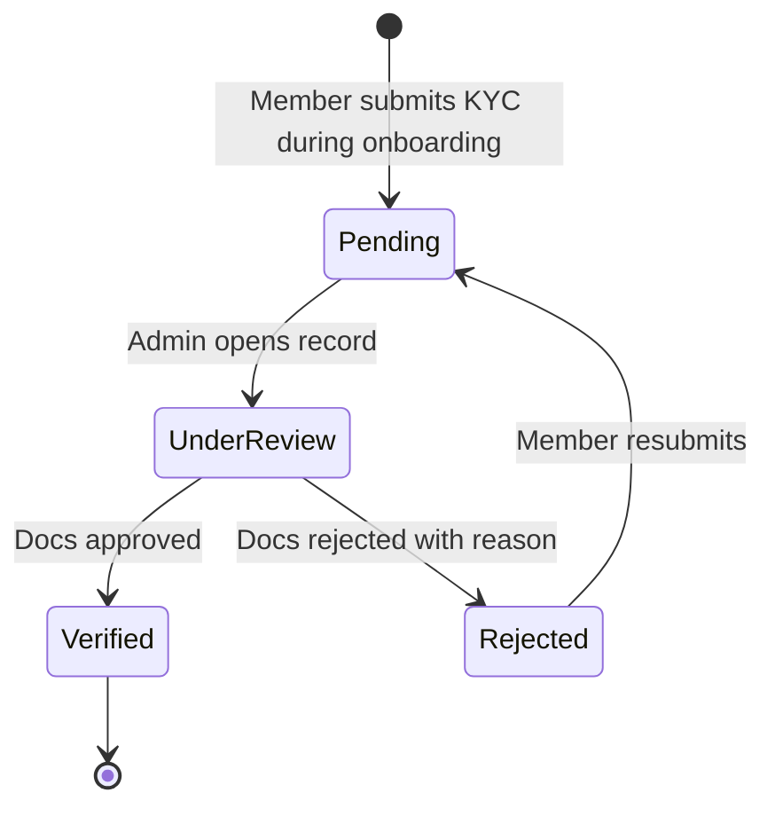

# Functional Spec

> **v3.2 · Last verified July 2026** against `src/routes.tsx`, the live database, edge functions and storage buckets.

Module-by-module specification with acceptance criteria. Each module names its data dependencies, the role gates that apply, and the behaviour expected on the happy path.

## Module map

## Home modules

Home (`/`) renders, in order: **HomeHero** → Homepage banner ad → **LiveTicker** → **QuickActionsGrid** (4 tiles, live counts for Bulletin + RFQ) → **CategoryGrid** (two horizontal snap-strips: 4 mobile / 8 desktop tiles, featured first) → interstitial ad → **New Products** (`RecentListingsList`) → **New Members** (`NewMembersList`) → **MembershipCTA**. All modules obey controlled-transparency; ads live in the `ad-assets` bucket, admin-only write.

## Discovery modules

### Directory `/directory`
- Lists verified Association members from the live database only (DATA-001).
- Public list (name, badges, city, category chips). Full contact card requires Paid or Feature Access ON.
- Filters: category, city, verified, broker (accepts `?type=Broker`, which is where the retired `/broker` route now redirects).
- **Acceptance:** a member added in admin appears within one cache cycle; non-Paid users see "Become a member to view contact" instead of phone numbers.

### Member Profile `/directory/:slug`
- Public summary; storefront link; "Contact seller" CTA (auth-gated reveal).
- **Acceptance:** an unauthenticated visitor tapping Contact is sent to `/login` and returned to the same profile.

### Storefront `/store/:slug`
- A single member's curated product showcase with brand strip, featured products, and category tabs.
- Backed by the `companies_public` view (`security_invoker=true`), which grants safe columns only to `anon` / `authenticated` (no `email`, `phone`, `gstin`, `address`).
- **Acceptance:** only Paid members can have a storefront; URL for non-Paid resolves to a 404-style empty state; sticky contact bar reveals wa.me only for Paid or Feature Access ON.

### Products `/products` and `/products/:slug`
- Cross-member catalogue with variant-level browsing.
- Price shown as a range; stock as a band; demand trend from BIL signal (or local fallback).
- **Acceptance:** no rendered price matches an exact rupee value from the database.

### Brands `/brands` and `/brands/:slug`
- Cross-company house-brand discovery. Brand page links to the brand's products and to the owning company's storefront. Branded SKUs may link to an external B2C URL.
- **Acceptance:** brands without active products are still listed and show an empty state on the brand page.

### Community Feed `/market`
- The live posting surface. Replaces the older "Market News" page and the retired `/community` route (which now redirects here).
- Tables: `community_posts`, `post_comments`, `post_likes`, `post_views`, `post_polls`, `post_poll_options`, `post_poll_votes`, `anonymous_identity_log` (admin-only RLS).
- Compose supports **text · images (clipboard paste, up to N per post) · PDFs · polls · price ranges · anonymous toggle**. Links auto-expand into rich previews via the `fetch-link-preview` edge function (oEmbed for YouTube/Vimeo, direct-image/video/PDF detection). Pinned rate cards can be featured by admins.
- Compose media uploads land in the `community-media` bucket. Update policy on the bucket requires `is_paid_or_admin` — losing paid status removes overwrite rights.
- Engagement bar uses a thumbs-up icon (not a heart).
- Access tiers: **paid + admin** can post/comment/like/poll; **free members** are read-only for 7 days then hit a paywall overlay; **guests** see a teaser; **anonymous posting** is paid-only and the real identity is written to `anonymous_identity_log` for admin audit.
- When **Feature Access** is ON (`is_features_open() = true`), RLS opens read to guests + free members.
- Floating "Post" FAB: `z-50`, `bottom-24` so it clears the mobile bottom tabs.
- **Acceptance:** paid users can post/like/comment/poll; free users past 7 days see the paywall overlay; anonymous posts hide the author from other members but are visible to admins via the log; pin escalation is blocked at RLS (`WITH CHECK` prevents authors from self-pinning).

### RFQ board `/rfq`
- Paid members and admins create and browse RFQ listings (buy or sell intent).
- Backed by `rfq_listings` (1–90 day expiry) and `rfq_contact_reveals`. Contact reveal is a one-tap flow gated by the `get_company_whatsapp` RPC and logged.
- The legacy `rfqs` / `inquiry_products` / `rfq_responses` cart schema, `CartContext`, `CartFab` / `CartDrawer` / `RFQModal` and `/account/rfqs` inbox remain **removed**.
- When Feature Access is ON, RLS opens read to guests + free members.
- **Acceptance:** a paid member creates a listing with expiry; another paid member reveals contact once and the reveal appears in `rfq_contact_reveals`; expired listings drop from the public feed.

### Bulletin `/circulars` and `/circulars/:slug`
- Admin-managed announcements with title, slug, body, optional attachment URL, `published_at`. Renamed from "Circulars & Notices" to **Bulletin** in the UI while keeping the `/circulars` URLs for continuity.
- Attachments served via **1-hour signed URLs** (tightened from the earlier 5-year signing).
- **Acceptance:** drafts are not visible to non-admins; published entries are reachable by slug; the home QuickActions "Bulletin" tile shows a live count of published entries.

## Public authority pages

| Route | Contents | Notes |
|---|---|---|
| `/` | Home shell above | Prerendered |
| `/about` | Association history + committee members + office bearers | Prerendered |
| `/membership` | 2-card grid (Free vs Paid) + side-by-side comparison table | Prerendered |
| `/apply` | Single Paid plan checkout + "I operate as a broker" flag | — |
| `/install` | PWA install guide (iOS Safari, Android Chrome) | Prerendered |
| `/knowledge` | Article index (markdown-backed via `src/content/knowledge/*.md`, loaded through `import.meta.glob`) | Prerendered |
| `/knowledge/:slug` | Individual article | Prerendered |
| `/faq` | Categorised FAQs + `FAQPage` JSON-LD generated from the same source | Prerendered |
| `/contact` | Real office address, phone, hours, Grievance Officer, mailto form | Prerendered |
| `/circulars`, `/circulars/:slug` | Bulletin (see above) | Prerendered |

## Forms `/forms`

Two tabs only: **Advertise** and **Submit Circular**. The Verification Request tab has been removed (v3.1.3) — verification is admin-driven through `/account/moderation`. Contact phone number is **+91 98200 69545**.

## Account hub `/dashboard`, `/account/*`

Mobile bottom-tab "Account" opens `/dashboard`. The dashboard shows a gold-underlined hero card, the **OnboardingChecklist** (5 live-progress steps) and the dismissible **InstallAppNudge** (dismissal persisted in `localStorage.mddma:install-nudge-dismissed`).

| Route | Purpose |
|---|---|
| `/account/profile` | Edit display name, contact preferences, view membership state |
| `/account/company` | Edit company name, GST, address, categories, branding |
| `/account/products` | CRUD products and variants (with image + video upload) |
| `/account/brands` | CRUD brands belonging to the user's company |
| `/account/moderation` | Admin only: approve companies, manage Bulletin + Ads, Community + RFQ moderation, Anonymous-log tab, **Feature Access** toggle |

There is **no `/account/rfqs`** and **no `/account/verify`** route. KYC tier promotion happens through admin moderation (`profiles.verification_tier`, `*_verified_at` timestamps) — the trigger `prevent_profile_privilege_escalation` blocks any non-admin write to those fields.

## Admin CMS `/account/moderation`

- **Bulletin CRUD:** title, slug, body, publish toggle, attachment.
- **Ads CRUD:** placement (home / category / directory), image (uploaded to `ad-assets`, admin-only write), link, active window. Ad slots are image-only (no title/footer strip) with a compact "Ad" badge and dot indicator when carousel.
- **Community moderation:** hide posts, soft-delete comments, pin (admin only — authors cannot self-pin).
- **RFQ moderation:** hide listings, mark expired.
- **Anonymous-post log:** admin-only view over `anonymous_identity_log` (RLS locked to admins).
- **Feature Access toggle:** flips `app_settings.features_open_to_all`; `useAppSettings` hook syncs it in real time; `RoleContext.isEffectivePaid` follows.
- **Member moderation:** approve verification, toggle broker flag, suspend, set `review_status` and `is_hidden`.

## Live ticker

Compact top-of-home ticker (`LiveTicker`) auto-scrolls curated APMC rate signals and admin-featured items. Never carries an exact price.

## SEO surfaces (GTM-001)

Public authority routes are prerendered, listed in `sitemap.xml`, and allowlist GPTBot / ClaudeBot / PerplexityBot / Google-Extended in `robots.txt`. `index.html` carries an Organization JSON-LD block. The transactional core (`/directory`, `/products`, `/store/:slug`, `/brands`, `/brands/:slug`, `/market`, `/rfq`, `/dashboard`, `/account/*`, `/documents`, `/login`, `/forms`) is `noindex` via `<Seo noindex />` and contains no price / stock / contact in indexable HTML.

## Acceptance principle

Every module ships with a single rule: **exact prices and exact stock figures must not appear in the rendered DOM**, regardless of role. UI components (`<GuardedPrice>`, `<PriceBand>`, `<StockBand>`, trend chip) are the enforcement point.

## Member-facing legal & policy pages

Privacy (doc 19), Terms (doc 20), Refund (doc 21) and Grievance (doc 22) live behind the `/documents` password today. Promoting them to public routes (`/privacy`, `/terms`, `/refund`, `/grievance`) with a footer link block is a follow-up task — required before Razorpay live mode and before any large-scale member onboarding.

## Read next

- **05 · Architecture & Tech** — how this is implemented.
- **23 · KYC & Verification Policy** — the trust ladder in policy form.
