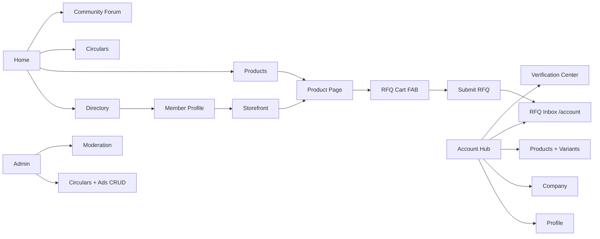
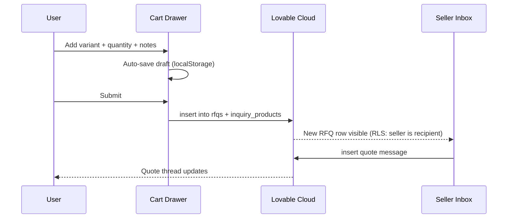
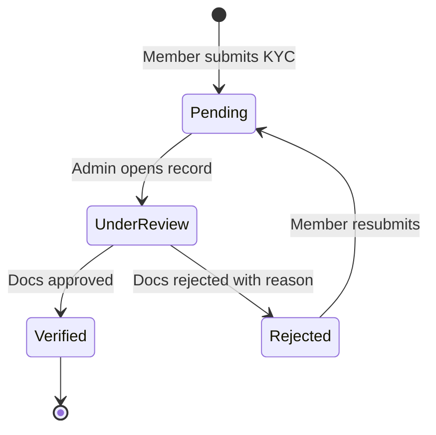

# Functional Spec

Module-by-module specification with acceptance criteria. Each module names its data dependencies, the role gates that apply, and the behaviour expected on the happy path.

## Module map

## Discovery modules

### Directory `/directory`
- Lists verified Association members merged from the live database with curated sample data; **live wins on slug conflict**.
- Public list view (name, badges, city, category chips). Full contact card requires Paid.
- Filters: category, city, verified, broker.
- **Acceptance:** new member added in admin appears in the list within one cache cycle; non-Paid users see "Become a member to view contact" instead of phone numbers.

### Member Profile `/directory/:slug`
- Public summary; storefront link; "Send RFQ" CTA (auth-gated).
- **Acceptance:** an unauthenticated visitor clicking RFQ is sent to login then back to the same profile.

### Storefront `/store/:slug`
- A single member's curated product showcase with brand strip, featured products, and category tabs.
- **Acceptance:** only Paid members can have a storefront; URL for non-Paid resolves to a 404-style empty state.

### Products `/products` and `/products/:slug`
- Cross-member catalogue with variant-level browsing.
- Price shown as a range; stock as a band; demand trend rendered from BIL signal (or local fallback).
- **Acceptance:** no price field in the rendered HTML matches an exact rupee value from the database.

## RFQ Engine

### Cart (global FAB + drawer)
- Multi-item: add variants from any product page across sessions.
- Drafts persist per browser; on login, drafts merge to the user's account.
- Submit requires Paid status; Free users are prompted to upgrade.

### Inbox `/account/rfqs`
- Two tabs: **Sent** (as buyer) and **Received** (as seller).
- Each row shows status badge (Submitted / Quoted / Negotiating / Closed / Expired) and last-activity timestamp.
- **Acceptance:** RLS guarantees a user only ever sees rows where they are buyer or seller.

## Community

### Forum `/community`
- Native posts + comments table; create post requires Free or higher; read is public.
- Categories: Market chatter, Help, Announcements (admin-only post).
- **Acceptance:** a new post by a Free member appears in the list immediately and persists across reload.

### Circulars `/circulars`
- Admin-managed announcements with title, body, optional attachment URL, published_at.
- **Acceptance:** drafts are not visible to non-admins.

## Account hub `/account/*`

| Route | Purpose |
|---|---|
| `/account/profile` | Edit display name, contact preferences |
| `/account/company` | Edit company name, GST, address, categories |
| `/account/products` | CRUD products and variants |
| `/account/rfqs` | RFQ inbox (Sent / Received) |
| `/account/verify` | Upload KYC docs and view verification status |
| `/account/moderation` | Admin only: members, posts, ads moderation |

## Admin CMS `/account/moderation`

- **Circulars CRUD:** title, body, publish toggle, attachment.
- **Ads CRUD:** placement (home / category / directory), image (uploaded to `ad-assets` bucket, admin-only write), link, active window.
- **Member moderation:** approve verification, toggle broker flag, suspend.
- **Forum moderation:** soft-delete posts and comments.

## Live market ticker

A global scrolling ticker (top of every page) renders curated market signals — port arrivals, festival cycles, broad rate movements. Sourced from circulars marked as "ticker eligible" and admin-curated entries. Never carries an exact price.

## Acceptance principle

Every module ships with a single rule: **exact prices and exact stock figures must not appear in the rendered DOM**, regardless of role. UI components (`<GuardedPrice>`, stock-band, trend chip) are the enforcement point.

## Read next

- **05 · Architecture & Tech** — how this is implemented.
