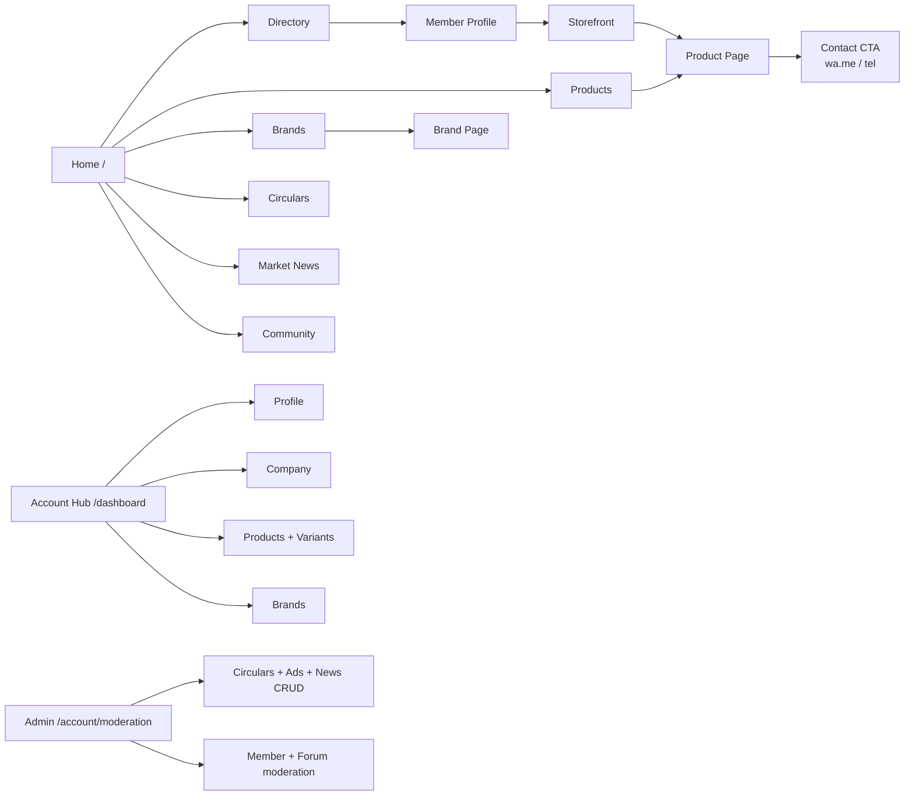
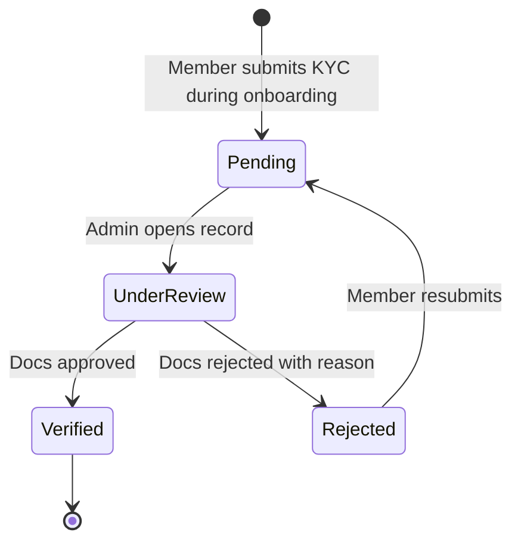

# Functional Spec

> **v3.2 Update Notice (July 2026)** — This doc has been updated for **v3.2**. Key changes since v3.1.3:
>
> - **RFQ is back**, under a new schema. The `/rfq` route is live, backed by the `rfq_listings` and `rfq_contact_reveals` tables. It is open to paid members and admins; contact reveal is logged. The old `rfqs` / `inquiry_products` / `rfq_responses` tables, the multi-item RFQ cart, `CartContext`, `CartFab` / `CartDrawer` / `RFQModal`, and the `/account/rfqs` inbox all remain **removed**. Any older reference below to those artifacts is historical.
> - **`/market` is now the Community Feed**, not Market News. It uses `community_posts`, `post_comments`, `post_likes`, `post_views`, and `anonymous_identity_log` (admin-only RLS). Paid + admin can post; free members are read-only for the first 7 days; guests see a teaser; anonymous posting is paid-only.
> - **Mobile bottom tab bar** order is now **Home (`/`) · Market (`/market`) · RFQ (`/rfq`) · Members (`/directory`) · Account (`/dashboard`)**.
> - **Admin Feature Access toggle** — while the pilot is running, admins can flip a global switch (`app_settings.features_open_to_all`, exposed via the `is_features_open()` SQL function) that temporarily opens Community Feed posts and RFQ listings to guests and free members. RLS on `community_posts` and `rfq_listings` reads `is_features_open()`; the frontend reads `featuresOpen` / `isEffectivePaid` from `RoleContext`. Managed from **Admin → Moderation → Feature Access**.
>
> The **/forms Verification Request** flow remains **removed** — members are verified during admin onboarding, not via a self-serve form.

---

Module-by-module specification with acceptance criteria. Each module names its data dependencies, the role gates that apply, and the behaviour expected on the happy path.

## Module map

## Home modules

Home (`/`) renders, in order: Homepage banner ad → `TodayHeader` → `LiveRatesTicker` (compact vertical padding) → `QuickActionsGrid` → `CategoryGrid` → **`RecentListingsList` (New Products)** → **`NewMembersList`** → `MembershipCTA` → `PartnersStrip`. Live ticker and ad slots are admin-managed; never render exact prices.

## Discovery modules

### Directory `/directory`
- Lists verified Association members from the live database only (DATA-001). Sample arrays in `src/data/` remain as type fixtures and offline-preview material; they are not merged into production reads.
- Public list view (name, badges, city, category chips). Full contact card requires Paid.
- Filters: category, city, verified, broker.
- **Acceptance:** new member added in admin appears in the list within one cache cycle; non-Paid users see "Become a member to view contact" instead of phone numbers.

### Member Profile `/directory/:slug`
- Public summary; storefront link; "Contact seller" CTA (auth-gated reveal).
- **Acceptance:** an unauthenticated visitor clicking Contact is sent to login then back to the same profile.

### Storefront `/store/:slug`
- A single member's curated product showcase with brand strip, featured products, and category tabs.
- Backed by the `companies_public` view; reads only the safe column set (no `email`, `phone`, `gstin`, `address` exposed to anon).
- **Acceptance:** only Paid members can have a storefront; URL for non-Paid resolves to a 404-style empty state.

### Products `/products` and `/products/:slug`
- Cross-member catalogue with variant-level browsing.
- Price shown as a range; stock as a band; demand trend rendered from BIL signal (or local fallback).
- **Acceptance:** no price field in the rendered HTML matches an exact rupee value from the database.

### Brands `/brands` and `/brands/:slug`
- Cross-company house-brand discovery. Brand page links to the brand's products and to the owning company's storefront. Branded SKUs may link out to an external B2C URL.
- **Acceptance:** brands without active products are still listed but show an empty state on the brand page.

### Broker board `/broker`
- Filters companies where `is_broker = true`. Same ₹10K paid tier — broker is a flag, not a separate SKU.

### Community Feed `/market` (v3.2)
- The `/market` route is the **Community Feed** — the live posting surface for members. It replaces the older "Market News" page.
- Backed by `community_posts`, `post_comments`, `post_likes`, `post_views`, and `anonymous_identity_log` (admin-only RLS).
- Access tiers: **paid + admin** can post and comment; **free members** are read-only for their first 7 days; **guests** see a teaser overlay; **anonymous posting** is paid-only, with the real identity stored in `anonymous_identity_log` for admin audit.
- When the admin **Feature Access** toggle (`app_settings.features_open_to_all = true`) is on, guests and free members can read the full feed and RFQ listings without upgrading.
- **Acceptance:** paid users can post/like/comment; free users past 7 days see the paywall overlay; anonymous posts hide the author name from other members but remain visible to admins via the log.

### RFQ board `/rfq` (v3.2)
- The `/rfq` route is the reintroduced RFQ surface. Paid members and admins can create and browse RFQ listings; contact reveal is gated and logged in `rfq_contact_reveals` via the `get_company_whatsapp` RPC.
- Backed by `rfq_listings` (1–90 day expiry) and `rfq_contact_reveals`. The old `rfqs` / `inquiry_products` / `rfq_responses` cart-based schema remains dropped.
- **Acceptance:** a paid member can create a listing with expiry; another paid member can reveal contact once, with the reveal logged.

## Community

### Forum `/community`
- Discourse embed remains available as the long-form discussion surface.
- The v3.2 Community Feed at `/market` is the day-to-day posting surface; `/community` is for threaded discussion.
- **Acceptance:** the embedded forum loads.

### Circulars `/circulars` and `/circulars/:slug`
- Admin-managed announcements with title, slug, body, optional attachment URL, `published_at`.
- **Acceptance:** drafts are not visible to non-admins; published circulars are reachable by slug.

## Forms `/forms` (also `/contact`)

Two tabs only (v3.1.3): **Advertise** and **Submit Circular**. The previous **Verification Request** tab has been removed — verification is admin-driven through `/account/moderation`.

## Account hub `/dashboard`, `/account/*`

The mobile bottom tab "Account" opens `/dashboard`. From there, members reach:

| Route | Purpose |
|---|---|
| `/account/profile` | Edit display name, contact preferences, view membership state |
| `/account/company` | Edit company name, GST, address, categories, branding |
| `/account/products` | CRUD products and variants (with image + video upload) |
| `/account/brands` | CRUD brands belonging to the user's company |
| `/account/moderation` | Admin only: approve companies, manage circulars, ads, market news, member moderation |

There is **no `/account/rfqs`** and **no `/account/verify`** route. KYC tier promotion happens through admin moderation (`profiles.verification_tier`, `*_verified_at` timestamps) — the trigger `prevent_profile_privilege_escalation` blocks any non-admin write to those fields.

## Admin CMS `/account/moderation`

- **Circulars CRUD:** title, slug, body, publish toggle, attachment.
- **Ads CRUD:** placement (home / category / directory), image (uploaded to `ad-assets` bucket, admin-only write), link, active window.
- **Market News CRUD:** admin-curated entries surfaced on `/market-news` and home.
- **Member moderation:** approve verification, toggle broker flag, suspend, set `review_status` and `is_hidden`.
- **Forum moderation:** soft-delete posts and comments in the native archive.

## Live market ticker

A global, vertically-compact scrolling ticker (top of home) renders curated market signals — port arrivals, festival cycles, broad rate movements. Sourced from circulars marked as "ticker eligible" and admin-curated entries. Never carries an exact price.

## Knowledge & SEO surfaces

The public-authority routes — `/`, `/about`, `/membership`, `/apply`, `/install`, `/circulars`, `/circulars/:slug`, `/knowledge`, `/knowledge/:slug`, `/faq`, `/contact` — are prerendered, AI-crawler-friendly (GPTBot / ClaudeBot / PerplexityBot / Google-Extended allowed), and listed in `sitemap.xml`. The transactional core — `/directory`, `/products`, `/store/:slug`, `/brands`, `/brands/:slug`, `/broker`, `/market`, `/community`, `/dashboard`, `/account/*`, `/documents`, `/login`, `/forms` — is `noindex` and contains no price / stock / contact in indexable HTML (GTM-001).

## Acceptance principle

Every module ships with a single rule: **exact prices and exact stock figures must not appear in the rendered DOM**, regardless of role. UI components (`<GuardedPrice>`, stock-band, trend chip) are the enforcement point.

## Member-facing legal & policy pages

Privacy (doc 19), Terms (doc 20), Refund (doc 21) and Grievance (doc 22) currently live behind the `/documents` password alongside the rest of the suite. Promoting them to **public routes** (`/privacy`, `/terms`, `/refund`, `/grievance`) with a footer link block is a follow-up task — required before Razorpay live mode and before any large-scale member onboarding. The markdown bodies are already counsel-ready drafts; promotion is a routes-and-layout change, not a content change.

## Read next

- **05 · Architecture & Tech** — how this is implemented.
- **23 · KYC & Verification Policy** — the trust ladder in policy form.
