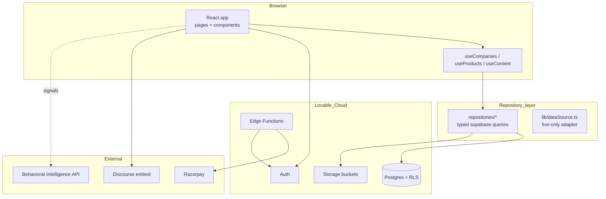
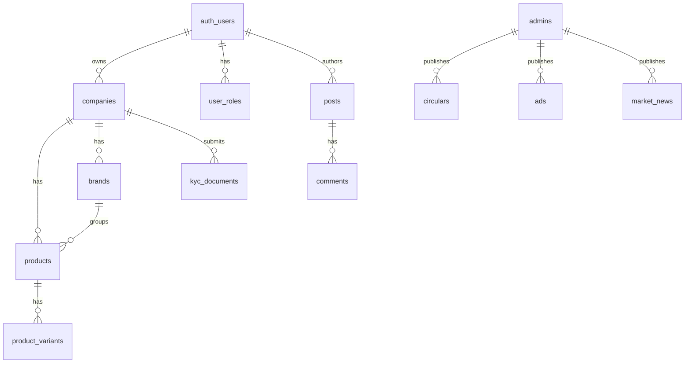
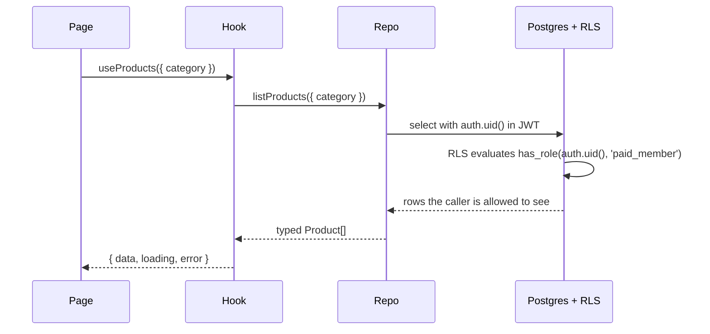

# Architecture & Tech

> **v3.2 Update Notice (July 2026)** — This doc has been updated for **v3.2**. Key changes since v3.1.3:
>
> - **RFQ is back**, under a new schema. The `/rfq` route is live, backed by the `rfq_listings` and `rfq_contact_reveals` tables. It is open to paid members and admins; contact reveal is logged. The old `rfqs` / `inquiry_products` / `rfq_responses` tables, the multi-item RFQ cart, `CartContext`, `CartFab` / `CartDrawer` / `RFQModal`, and the `/account/rfqs` inbox all remain **removed**. Any older reference below to those artifacts is historical.
> - **`/market` is now the Community Feed**, not Market News. It uses `community_posts`, `post_comments`, `post_likes`, `post_views`, and `anonymous_identity_log` (admin-only RLS). Paid + admin can post; free members are read-only for the first 7 days; guests see a teaser; anonymous posting is paid-only.
> - **Mobile bottom tab bar** order is now **Home (`/`) · Market (`/market`) · RFQ (`/rfq`) · Members (`/directory`) · Account (`/dashboard`)**.
> - **Admin Feature Access toggle** — while the pilot is running, admins can flip a global switch (`app_settings.features_open_to_all`, exposed via the `is_features_open()` SQL function) that temporarily opens Community Feed posts and RFQ listings to guests and free members. RLS on `community_posts` and `rfq_listings` reads `is_features_open()`; the frontend reads `featuresOpen` / `isEffectivePaid` from `RoleContext`. Managed from **Admin → Moderation → Feature Access**.
>
> The **/forms Verification Request** flow remains **removed** — members are verified during admin onboarding, not via a self-serve form.

---

The implementation reference: stack, layering, data model, auth model, the Behavioral Intelligence Layer contract, and the rules that keep the codebase honest.

## Stack

| Layer | Choice | Why |
|---|---|---|
| Frontend | React 18 + Vite 5 + TypeScript 5 | Lovable native, fast HMR |
| Styling | Tailwind 3 + shadcn/ui + HSL semantic tokens | Navy + gold corporate palette; dark-mode safe |
| Routing | React Router v6 (`BrowserRouter`) | SPA fallback handled by Lovable hosting |
| Data | TanStack Query (`@tanstack/react-query`) | Caching + invalidation over the repository layer |
| Backend | **Lovable Cloud** (Auth, Postgres, Storage, Edge Functions) | Single managed surface, no external accounts |
| Payments | Razorpay (single Paid plan, broker is a flag) | India-first, UPI native; **test-mode only** until LEGAL-001 |
| Forum | Discourse embed (primary) + native archive tables | Lower moderation burden, richer threading |
| Behavioral Intelligence Layer | **External API service** (TECH-001) | Compute-heavy; lives outside edge functions |

## System architecture

## Layering rules

1. **Pages** never call `supabase.from()` directly. They call hooks.
2. **Hooks** (`src/hooks/queries/*`) own loading/error state and call repositories.
3. **Repositories** (`src/repositories/*`) own typed `supabase.from()` queries and shape responses.
4. **`lib/dataSource.ts`** adapts live database rows into UI-shape entries (`DirectoryEntry`, `ProductEntry`). It is **live-only** (DATA-001) — sample arrays in `src/data/*` are kept as type fixtures and for offline previews, never merged into production reads.

This split is what stopped the "KGVPL invisible" class of bugs: there is exactly one place a discovery list is built.

## Data model

Key tables:

- `companies` — one per Paid member; carries `is_broker`, `is_verified`, slug, categories, `review_status`, `is_hidden`. Read by the public via the `companies_public` view (security_invoker, safe-column SELECT grants only).
- `brands` — house brands per company; powers `/brands`, `/brands/:slug` and the storefront brand strip.
- `products` + `product_variants` — variant-level pricing input (never rendered exactly).
- `posts` + `comments` — native forum (read-only archive; Discourse is primary).
- `circulars`, `ads`, `market_news` — admin CMS content.
- `user_roles` — **separate table**, never a column on `companies`. Roles are checked via a `SECURITY DEFINER` `has_role(uid, role)` function used inside RLS policies.

The `rfqs` and `inquiry_products` tables and their RLS policies have been **dropped** (v3.1.3). Do not reintroduce.

## Auth & RLS

Rules:

- **Roles live in `user_roles`**, never on profiles or companies. Storing roles on a profile is a privilege-escalation risk.
- Every table that holds member data has RLS enabled and policies that call `public.has_role(auth.uid(), 'admin'::app_role)` or check `auth.uid() = owner_id`.
- Every public-schema table has explicit `GRANT` statements alongside its policies — RLS alone is not enough on Lovable Cloud.
- `companies_public` is a `security_invoker=true` view. `anon` and `authenticated` are granted column-level SELECT on the **safe** columns of `public.companies` only (id, owner_id, slug, name, tagline, description, logo_url, cover_url, city, state, country, website, established_year, categories, certifications, social_links, is_verified, is_hidden, membership_tier, review_status, is_sponsored, verification_tier_label, languages, hours, markets, timestamps). Sensitive columns (`email`, `phone`, `gstin`, `address`) are not granted to public roles.
- The `ad-assets` storage bucket is admin-only write, public read.

## Behavioral Intelligence Layer

The BIL is **external**, not an edge function. It receives anonymised signal events (search, contact-reveal, page view) and serves back demand-trend chips and ranking weights consumed by `Products`, `Storefront` and `Brands`.

| Direction | Endpoint shape | Consumer |
|---|---|---|
| **Inbound (events)** | `POST /events` `{ type, payload, ts }` | Frontend fires on key interactions |
| **Outbound (signals)** | `GET /signals?scope=...` | `useContent` hook merges into product / brand cards |

The frontend treats BIL as best-effort: if the API is down, components fall back to a local trend computed from recent listing activity.

## Edge functions

Functions deploy from `supabase/functions/<name>/index.ts`. Detail in **08 · Edge Functions Reference**.

| Function | Purpose | Auth model |
|---|---|---|
| `verify-doc-password` | Gates `/documents/*` with the shared committee password (`DOCS_PASSWORD` secret) | None — constant-time secret compare in code |
| `get-internal-doc` | Returns markdown for the password-gated internal docs (**07–28**, 22 docs). Same password; bodies never ship to the client bundle | None — password verified per request |
| `razorpay-create-payment-link` | Generates a Razorpay payment link for a pending membership | JWT bearer; verified to be admin via `user_roles` |
| `razorpay-webhook` | Receives `payment_link.paid` and activates the membership + role grant | None at JWT layer; HMAC signature verified via `RAZORPAY_WEBHOOK_SECRET` |

Internal-doc bodies live as loose markdown in `supabase/functions/get-internal-doc/content/*.md` and are bundled into `content.ts` (regenerated via `bunx tsx scripts/build-internal-docs-bundle.ts` whenever a file is added). The edge function imports the bundle and resolves a slug → file mapping; there are no filesystem reads at runtime.

There is **no** `promote-verification` edge function and **no** RFQ-related edge function in the current build. KYC tier promotion is performed by admins directly (via service-role writes from `/account/moderation`) — the `prevent_profile_privilege_escalation` trigger blocks any other path.

## Storage buckets

| Bucket | Public read | Write | Used for |
|---|---|---|---|
| `avatars` | yes | owner | Profile avatars |
| `company-assets` | yes | company owner | Logos, covers, gallery |
| `product-images` | yes | company owner | Product cover, gallery (max 3), product video |
| `ad-assets` | yes | **admin only** | Homepage / category / directory ad creative |

Size limits and validation live in `src/lib/storage.ts` — 10 MB for images, 100 MB for videos, SVGs explicitly rejected.

## Frontend conventions

- HSL semantic tokens only — no `text-white`, no hardcoded hex, no inline color utilities.
- shadcn components customised via `class-variance-authority` variants, never inline overrides.
- Multi-step forms use react-hook-form + zod.
- All async UI returns explicit `{ data, loading, error }` from hooks.

## Read next

- **04 · Functional Spec** — what each module does.
- **06 · Build & Operations** — how to run and ship it.
