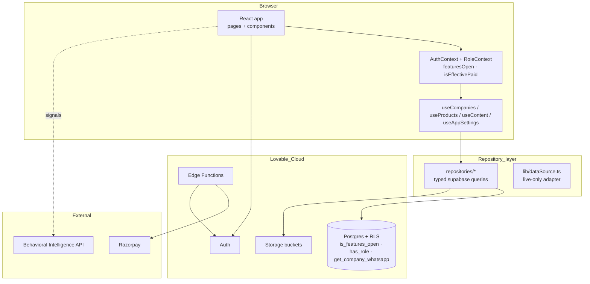
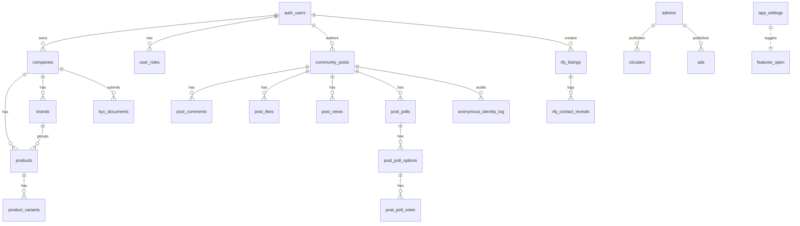
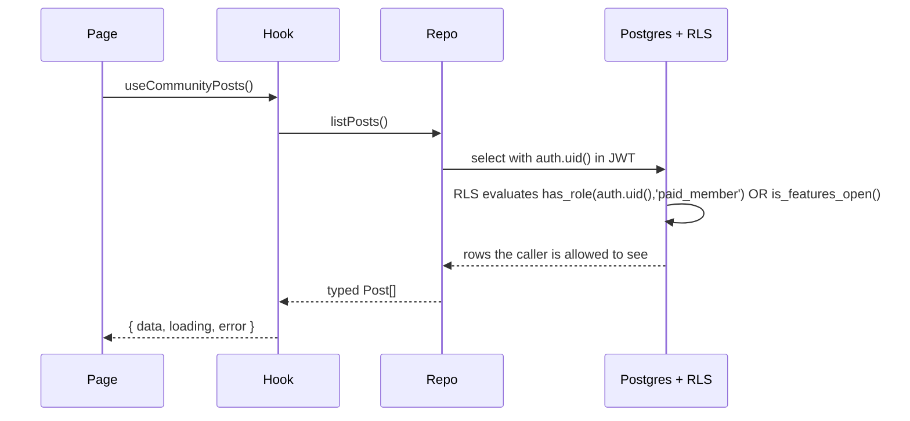

# Architecture & Tech

> **v3.2 · Last verified July 2026** against the live schema, edge functions, storage buckets and `src/` layout.

The implementation reference: stack, layering, data model, auth model, the Behavioral Intelligence Layer contract, and the rules that keep the codebase honest.

## Stack

| Layer | Choice | Why |
|---|---|---|
| Frontend | React 18 + Vite 5 + TypeScript 5 | Lovable native, fast HMR |
| Styling | Tailwind 3 + shadcn/ui + HSL semantic tokens | GoKwik-inspired "Warm Commerce" palette (gold `#d8a86a`, cream, navy); dark-mode safe; **hard-coded utilities forbidden** |
| Routing | React Router v6 (`BrowserRouter`) — v6.30.1+ security-patched | SPA fallback handled by Lovable hosting |
| Data | TanStack Query (`@tanstack/react-query`) | Caching + invalidation over the repository layer |
| Backend | **Lovable Cloud** (Auth, Postgres, Storage, Edge Functions) | Single managed surface, no external accounts |
| Payments | Razorpay (single Paid plan, broker is a flag) | India-first, UPI native; **test-mode only** until LEGAL-001 |
| Community Feed | Native (`community_posts`, `post_comments`, `post_likes`, `post_views`, `post_polls*`, `anonymous_identity_log`) | Replaced earlier Discourse embed for the day-to-day surface |
| Behavioral Intelligence Layer | **External API service** (TECH-001) | Compute-heavy; lives outside edge functions |

## System architecture

## Layering rules

1. **Pages** never call `supabase.from()` directly. They call hooks.
2. **Hooks** (`src/hooks/queries/*`) own loading/error state and call repositories.
3. **Repositories** (`src/repositories/*`) own typed `supabase.from()` queries and shape responses.
4. **`lib/dataSource.ts`** adapts live database rows into UI-shape entries (`DirectoryEntry`, `ProductEntry`). It is **live-only** (DATA-001) — sample arrays in `src/data/*` are kept as type fixtures and for offline previews, never merged into production reads.

## Data model

Key tables:

- `companies` — one per Paid member; carries `is_broker`, `is_verified`, slug, categories, `review_status`, `is_hidden`. Read by the public via the `companies_public` view (security_invoker, safe-column SELECT grants only). PII columns (`email`, `phone`, `gstin`, `address`) have **no SELECT grants** to `anon` or `authenticated`.
- `brands` — house brands per company; powers `/brands`, `/brands/:slug`, storefront brand strip.
- `products` + `product_variants` — variant-level pricing input (never rendered exactly).
- `community_posts` + engagement tables — the `/market` surface. RLS reads `is_features_open()` so the admin Feature Access toggle can open reads to everyone without policy edits.
- `rfq_listings` + `rfq_contact_reveals` — v3.2 RFQ board. Reveal goes through the `get_company_whatsapp` RPC and is logged.
- `anonymous_identity_log` — admin-only RLS; maps anonymous community posts to their real author for audit.
- `app_settings` — single-row config table exposing `features_open_to_all`; wrapped by the SQL helper `is_features_open()`.
- `user_roles` — **separate table**, never a column on `companies`. Roles are checked via a `SECURITY DEFINER` `has_role(uid, role)` function used inside RLS policies.

The old `rfqs`, `inquiry_products` and `rfq_responses` tables (multi-item cart schema) remain **dropped**. Do not reintroduce.

## Auth & RLS

Rules:

- **Roles live in `user_roles`**, never on profiles or companies.
- Every table that holds member data has RLS enabled and policies calling `public.has_role(auth.uid(), 'admin'::app_role)` or checking `auth.uid() = owner_id`. Reads on `community_posts` and `rfq_listings` also OR against `is_features_open()`.
- Every public-schema table has explicit `GRANT` statements alongside its policies — RLS alone is not enough on Lovable Cloud.
- `companies_public` is a `security_invoker=true` view. `anon` and `authenticated` are granted column-level SELECT on the **safe** columns of `public.companies` only.
- Sensitive columns (`email`, `phone`, `gstin`, `address`) are not granted to public roles.
- `post_likes` and `post_views` SELECT grants are tightened to owner + admin (fixes the "any authenticated user can read all likes/views" finding).
- Community `WITH CHECK` prevents authors from self-pinning posts (pin escalation guard).
- `community-media` bucket UPDATE policy requires `is_paid_or_admin` — free members cannot overwrite their own files after losing paid status.
- `circular-assets` bucket is authenticated-only read; served via **1-hour signed URLs**.
- News/link inputs are sanitized to block XSS via `javascript:` and inline-event URLs.
- The `ad-assets` storage bucket is admin-only write, public read.

## Behavioral Intelligence Layer

The BIL is **external**, not an edge function. It receives anonymised signal events (search, contact-reveal, page view, RFQ create) and serves back demand-trend chips and ranking weights consumed by Products, Storefront and Brands.

| Direction | Endpoint shape | Consumer |
|---|---|---|
| **Inbound (events)** | `POST /events` `{ type, payload, ts }` | Frontend fires on key interactions |
| **Outbound (signals)** | `GET /signals?scope=...` | `useContent` hook merges into product / brand cards |

Frontend treats BIL as best-effort: if the API is down, components fall back to a local trend computed from recent activity.

## Edge functions

Functions deploy from `supabase/functions/<name>/index.ts`. Detail in **08 · Edge Functions Reference**.

| Function | Purpose | Auth model |
|---|---|---|
| `verify-doc-password` | Gates `/documents/*` with `DOCS_PASSWORD` secret | Constant-time secret compare |
| `get-internal-doc` | Returns markdown for the password-gated internal docs (07–28). Bodies never ship to the client bundle | Password verified per request |
| `fetch-link-preview` | Fetches OG/oEmbed metadata for Community Feed link cards (YouTube/Vimeo oEmbed, direct-image/video/PDF detection) | JWT (paid + admin authors) |
| `razorpay-create-payment-link` | Generates a Razorpay payment link for a pending membership | JWT bearer; admin-verified via `user_roles` |
| `razorpay-webhook` | Receives `payment_link.paid` and activates the membership + role grant | HMAC signature via `RAZORPAY_WEBHOOK_SECRET` |

Internal-doc bodies live as loose markdown in `supabase/functions/get-internal-doc/content/*.md` and are bundled into `content.ts` (regenerated via `bunx tsx scripts/build-internal-docs-bundle.ts` whenever a file changes).

There is **no** `promote-verification` edge function and **no** cart-style RFQ function. KYC tier promotion is performed by admins directly (via service-role writes from `/account/moderation`) — the `prevent_profile_privilege_escalation` trigger blocks any other path.

## Storage buckets

| Bucket | Public read | Write | Used for |
|---|---|---|---|
| `avatars` | yes | owner | Profile avatars |
| `company-assets` | yes | company owner | Logos, covers, gallery |
| `product-images` | yes | company owner | Product cover, gallery (max 3), product video |
| `ad-assets` | yes | **admin only** | Homepage / category / directory ad creative |
| `community-media` | yes | paid + admin (UPDATE requires `is_paid_or_admin`) | Community Feed images and PDFs |
| `circular-assets` | no — 1-hour signed URLs | admin | Bulletin attachments |

Size limits and validation live in `src/lib/storage.ts` — 10 MB for images, 100 MB for videos, SVGs explicitly rejected.

## Frontend conventions

- HSL semantic tokens only — no `text-white`, no hardcoded hex, no `bg-emerald-*` / `text-emerald-*`. Verified badges use the `success` token.
- shadcn components customised via `class-variance-authority` variants.
- Multi-step forms use react-hook-form + zod.
- All async UI returns explicit `{ data, loading, error }` from hooks.
- `useAppSettings` streams the Feature Access flag via realtime; `RoleContext` exposes `featuresOpen` and `isEffectivePaid` so components never re-check RLS.

## Read next

- **04 · Functional Spec** — what each module does.
- **06 · Build & Operations** — how to run and ship it.
