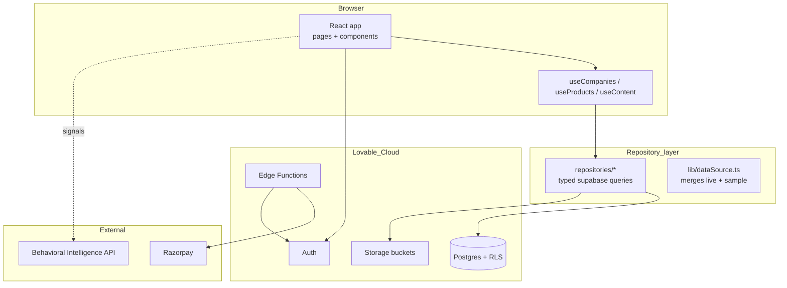
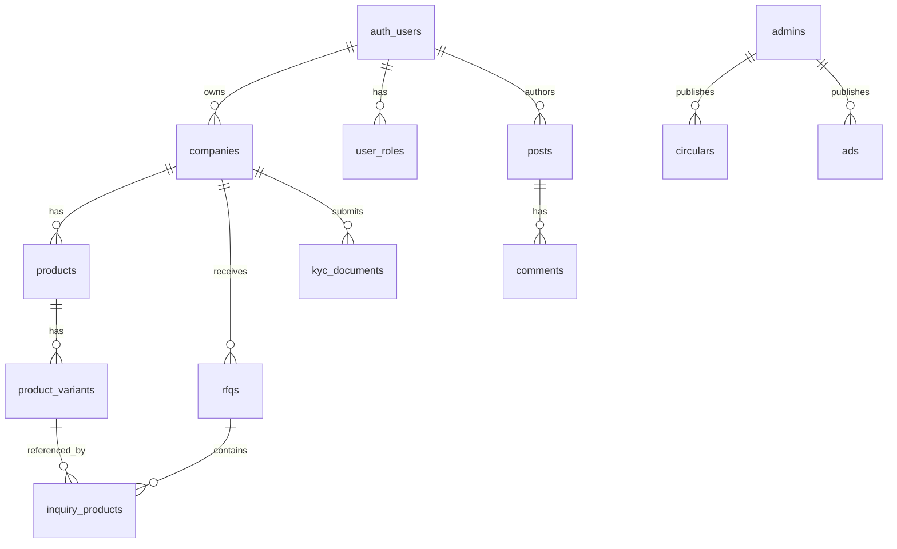
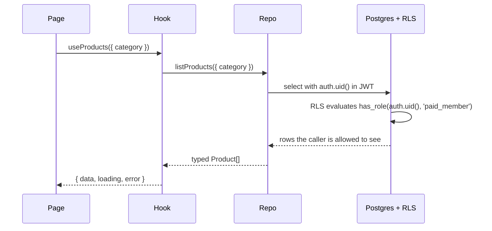

# Architecture & Tech

The implementation reference: stack, layering, data model, auth model, the Behavioral Intelligence Layer contract, and the rules that keep the codebase honest.

## Stack

| Layer | Choice | Why |
|---|---|---|
| Frontend | React 18 + Vite + TypeScript | Lovable native, fast HMR |
| Styling | Tailwind 3 + shadcn/ui + HSL semantic tokens | Brand-locked navy + gold |
| Routing | React Router (`BrowserRouter`) | SPA fallback handled by Lovable hosting |
| Backend | **Lovable Cloud** (Auth, Postgres, Storage, Edge Functions) | Single managed surface, no external accounts |
| Payments | Razorpay (membership + broker addon) | India-first, UPI native |
| Behavioral Intelligence Layer | **External API service** | Compute-heavy; lives outside edge functions |

## System architecture

## Layering rules

1. **Pages** never call `supabase.from()` directly. They call hooks.
2. **Hooks** (`src/hooks/queries/*`) own loading/error state and call repositories.
3. **Repositories** (`src/repositories/*`) own typed `supabase.from()` queries and shape responses.
4. **`lib/dataSource.ts`** merges live database rows with curated sample data (live wins on slug conflict). This is the seam that lets the demo look full from day one.

This split is what stopped the "KGVPL invisible" class of bugs: there is exactly one place a discovery list is built.

## Data model

Key tables:

- `companies` — one per Paid member; carries `is_broker`, `is_verified`, slug, categories.
- `products` + `product_variants` — variant-level pricing input (never rendered exactly).
- `rfqs` + `inquiry_products` — the multi-item RFQ as two normalised tables.
- `posts` + `comments` — native forum.
- `circulars`, `ads` — admin CMS content.
- `user_roles` — **separate table**, never a column on `companies`. Roles are checked via a `SECURITY DEFINER` `has_role(uid, role)` function used inside RLS policies.

## Auth & RLS

Rules:

- **Roles live in `user_roles`**, never on profiles or companies. Storing roles on a profile is a privilege-escalation risk.
- Every table that holds member data has RLS enabled and policies that call `public.has_role(auth.uid(), 'admin'::app_role)` or check `auth.uid() = owner_id`.
- The `ad-assets` storage bucket is admin-only write, public read.

## Behavioral Intelligence Layer

The BIL is **external**, not an edge function. It receives anonymised signal events (search, RFQ submission, quote turnaround) and serves back demand-trend chips and ranking weights consumed by `Products` and `Storefront`.

| Direction | Endpoint shape | Consumer |
|---|---|---|
| **Inbound (events)** | `POST /events` `{ type, payload, ts }` | Frontend fires on key interactions |
| **Outbound (signals)** | `GET /signals?scope=...` | `useContent` hook merges into product cards |

The frontend treats BIL as best-effort: if the API is down, components fall back to a local trend computed from recent RFQ activity.

## Edge functions

| Function | Purpose | JWT verify |
|---|---|---|
| `verify-doc-password` | Gates `/documents/*` with the shared committee password | off |
| `razorpay-create-payment-link` | Generates a payment link for membership / broker addon | on |
| `razorpay-webhook` | Confirms successful payment and promotes the user | off (signature verified) |
| `promote-verification` | Admin action: marks a company verified after KYC review | on |

## Storage buckets

| Bucket | Read | Write |
|---|---|---|
| `ad-assets` | public | admin only |
| `kyc-documents` | owner + admin | owner |
| `product-images` | public | owner |

## Frontend conventions

- HSL semantic tokens only — no `text-white`, no hardcoded hex.
- shadcn components customised via `class-variance-authority` variants, never inline overrides.
- Multi-step forms use react-hook-form + zod.
- All async UI returns explicit `{ data, loading, error }` from hooks.

## Read next

- **04 · Functional Spec** — what each module does.
- **06 · Build & Operations** — how to run and ship it.
