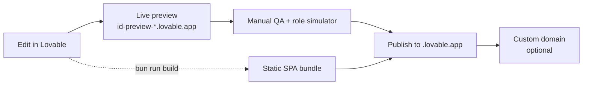
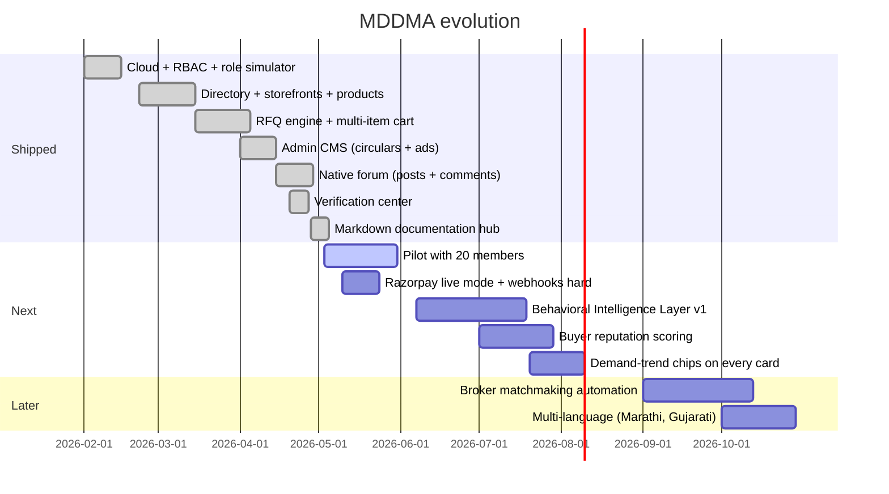

# Build & Operations

How to set up, run, ship, and evolve MDDMA. This is the playbook — not a status report.

## Environment setup

The project is a Lovable project. Cloning into a local Vite environment requires:

```bash
bun install
bun run dev
```

The frontend reads from `.env`, which Lovable Cloud manages automatically:

| Variable | Source |
|---|---|
| `VITE_SUPABASE_URL` | Auto-injected by Lovable Cloud |
| `VITE_SUPABASE_PUBLISHABLE_KEY` | Auto-injected by Lovable Cloud |
| `VITE_SUPABASE_PROJECT_ID` | Auto-injected by Lovable Cloud |

## Required secrets (edge functions)

Stored via the Lovable secrets manager; never committed to the repo.

| Secret | Used by |
|---|---|
| `DOC_PASSWORD` | `verify-doc-password` |
| `RAZORPAY_KEY_ID` | `razorpay-create-payment-link`, `razorpay-webhook` |
| `RAZORPAY_KEY_SECRET` | `razorpay-create-payment-link`, `razorpay-webhook` |
| `RAZORPAY_WEBHOOK_SECRET` | `razorpay-webhook` |
| `BIL_API_URL` (optional) | Frontend signal layer (build-time) |

## Seeding demo data

The directory and product list always render in a "looks full" state by merging live database rows with curated sample data from `src/data/sampleData.ts` and `src/data/productListings.ts`. Live rows win on slug conflict, so an admin can replace any sample entry by inserting a real company with the same slug.

To seed the database with realistic content for a pilot:

1. Sign in as an admin.
2. Open `/account/moderation` → **Members** → use the seed action.
3. Publish at least 3 circulars and 1 home-page ad to populate the home shell.

## Test strategy

Vitest unit tests live under `src/lib/__tests__/`. They cover the pure logic that controls money and trust:

- `membership.test.ts` — tier resolution
- `kyc.test.ts` — verification state transitions
- `tradeSignals.test.ts` — controlled-transparency formatting (no exact prices leak)

```bash
bunx vitest run
```

Run before any release.

## Build, preview, publish



The published site is a static SPA. Lovable hosting handles the SPA fallback automatically — `BrowserRouter` is the right choice; do not add `_redirects` or `vercel.json`.

## PWA install

`public/manifest.json` is configured for installability. On iOS Safari and Android Chrome, members get an "Add to Home Screen" prompt the second time they open the site. No native app is needed.

## Roadmap



## Operational runbook

| Situation | Action |
|---|---|
| **Member can't log in** | Check `auth.users` row exists; resend confirmation from auth panel |
| **Verification stuck** | Open `/account/moderation` → KYC tab → review docs |
| **RFQ not delivered** | Inspect `rfqs` row; confirm seller `company_id` matches; check RLS allows seller to read |
| **Payment received but not promoted** | Re-run `razorpay-webhook` with the event payload from Razorpay dashboard |
| **Doc vault password lost** | Update `DOC_PASSWORD` secret; redeploy `verify-doc-password` |
| **Live site blank** | Check Cloud project status; if `ACTIVE_HEALTHY`, hard-refresh; otherwise wait for state to recover |

## Backups & data ownership

The Postgres database, storage buckets, and edge function code all live in the Lovable Cloud project owned by the Association. Daily snapshots are retained by the platform. Member contact data and KYC documents must not be exported outside this project.

## Read next

- **01 · Vision & Pitch** — refresh on the why.
- **05 · Architecture & Tech** — internals reference.
