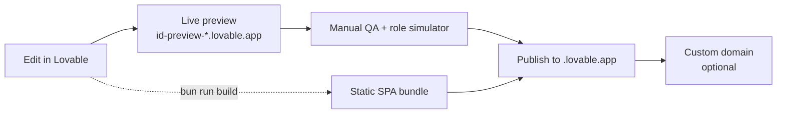
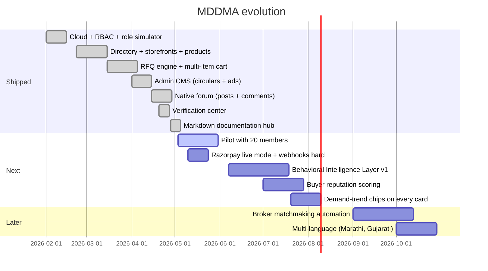

# Build & Operations

How to set up, run, ship, and evolve MDDMA. This is the playbook — not a status report.

## Environment setup

The project is a Lovable project. Cloning into a local Vite environment requires:

```bash
bun install
bun run dev
```

The frontend reads from `.env`, which Lovable Cloud manages automatically:

| Variable | Source |
|---|---|
| `VITE_SUPABASE_URL` | Auto-injected by Lovable Cloud |
| `VITE_SUPABASE_PUBLISHABLE_KEY` | Auto-injected by Lovable Cloud |
| `VITE_SUPABASE_PROJECT_ID` | Auto-injected by Lovable Cloud |

## Required secrets (edge functions)

Stored via the Lovable secrets manager; never committed to the repo. Inspect & rotate from **Lovable Cloud → Settings → Secrets**.

| Secret | Used by |
|---|---|
| `DOCS_PASSWORD` | `verify-doc-password`, `get-internal-doc` |
| `RAZORPAY_KEY_ID` | `razorpay-create-payment-link` |
| `RAZORPAY_KEY_SECRET` | `razorpay-create-payment-link` |
| `RAZORPAY_WEBHOOK_SECRET` | `razorpay-webhook` |
| `APP_URL` | `razorpay-create-payment-link` (callback redirect) |
| `LOVABLE_API_KEY` | Reserved — Lovable AI Gateway |
| `GOOGLE_SEARCH_CONSOLE_API_KEY` | Connector-managed; SEO ingest |
| `SUPABASE_URL`, `SUPABASE_ANON_KEY`, `SUPABASE_SERVICE_ROLE_KEY`, `SUPABASE_DB_URL`, `SUPABASE_JWKS`, `SUPABASE_PUBLISHABLE_KEY*`, `SUPABASE_SECRET_KEYS` | Auto-injected by Lovable Cloud — do not rotate manually |

## Seeding demo data

Directory, storefront, and product listings render **only live database rows** (see `src/lib/dataSource.ts`). The sample arrays in `src/data/sampleData.ts` and `src/data/productListings.ts` remain in the repo as type fixtures for tests and for offline previews — they are not merged into production reads.

To seed the database with realistic content for a pilot:

1. Sign in as an admin (`admin@mddma.org` is auto-granted `admin` by the `handle_new_user` trigger on first signup).
2. Open `/account/moderation` → approve member companies (`review_status='approved'`, `is_hidden=false`).
3. Publish at least 3 circulars and 1 active homepage ad to populate the home shell (RLS only shows ads that are `is_active` and inside `start_date`/`end_date`).

## Test strategy

Vitest unit tests live under `src/lib/__tests__/`. They cover the pure logic that controls money and trust:

- `membership.test.ts` — single-Paid-tier resolution and legacy fallback (`tierLabel`, `tierPriceInr`)

```bash
bunx vitest run
```

Run before any release. Lovable's harness runs builds automatically on every change; never run `bun run build` or `tsc` manually.

## Sitemap

`scripts/generate-sitemap.ts` writes `public/sitemap.xml` for the public routes. Re-run after adding a new public route:

```bash
bun run scripts/generate-sitemap.ts
```

## Build, preview, publish



The published site is a static SPA. Lovable hosting handles the SPA fallback automatically — `BrowserRouter` is the right choice; do not add `_redirects` or `vercel.json`.

## PWA install

`public/manifest.json` is configured for installability. On iOS Safari and Android Chrome, members get an "Add to Home Screen" prompt the second time they open the site. No native app is needed.

## Roadmap



## Operational runbook

| Situation | Action |
|---|---|
| **Member can't log in** | Check `auth.users` row exists; resend confirmation from Lovable Cloud → Users panel |
| **Verification stuck** | Open `/account/moderation` → companies tab → toggle `is_verified` or update `verification_tier` directly |
| **RFQ not delivered** | Inspect the `rfqs` row; confirm `company_id` matches a real company; check the seller is the `companies.owner_id` |
| **Payment received but not promoted** | Re-send the webhook event from Razorpay dashboard (idempotent), or grant the role manually via `INSERT INTO user_roles` |
| **Doc vault password lost** | Update the `DOCS_PASSWORD` secret in Cloud Settings; both `verify-doc-password` and `get-internal-doc` pick it up on next call |
| **Live site blank** | Run `cloud_status` (or check Cloud panel); if `ACTIVE_HEALTHY`, hard-refresh; otherwise wait for state to recover |
| **Upload fails silently** | Check console for `UploadValidationError` — usually file size (10 MB images / 100 MB videos) or unsupported MIME (SVG blocked) |

## Backups & data ownership

The Postgres database, storage buckets, and edge function code all live in the Lovable Cloud project owned by the Association. Daily snapshots are retained by the platform. Member contact data and KYC documents must not be exported outside this project.

## Read next

- **01 · Vision & Pitch** — refresh on the why.
- **05 · Architecture & Tech** — internals reference.
