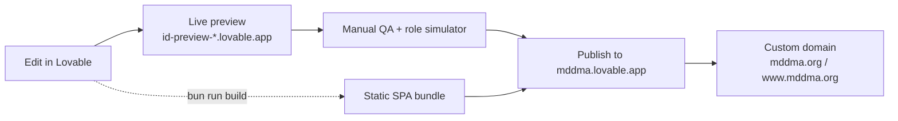
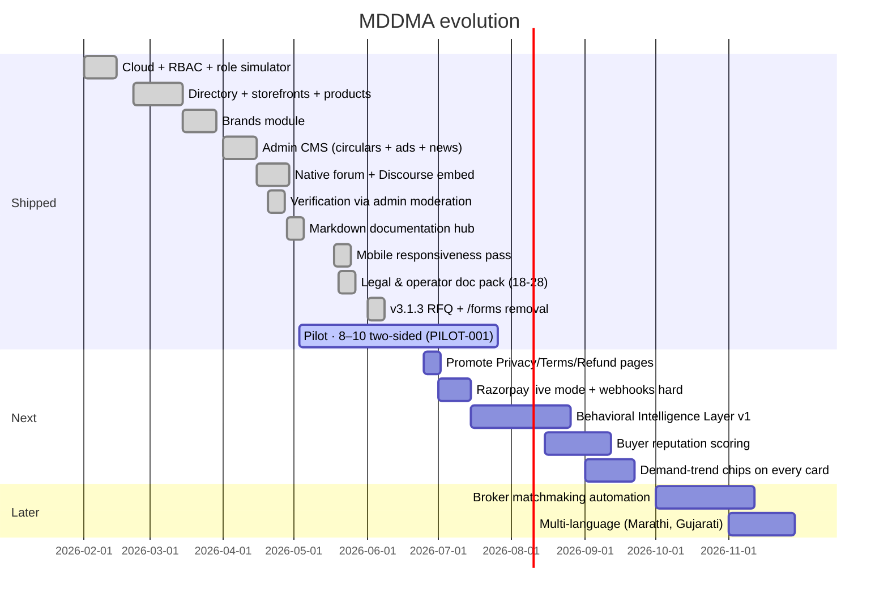

# Build & Operations


> **v3.2 Update Notice (July 2026)** — This doc has been updated for **v3.2**. Key changes since v3.1.3:
>
> - **RFQ is back**, under a new schema. The `/rfq` route is live, backed by the `rfq_listings` and `rfq_contact_reveals` tables. It is open to paid members and admins; contact reveal is logged. The old `rfqs` / `inquiry_products` / `rfq_responses` tables, the multi-item RFQ cart, `CartContext`, `CartFab` / `CartDrawer` / `RFQModal`, and the `/account/rfqs` inbox all remain **removed**. Any older reference below to those artifacts is historical.
> - **`/market` is now the Community Feed**, not Market News. It uses `community_posts`, `post_comments`, `post_likes`, `post_views`, and `anonymous_identity_log` (admin-only RLS). Paid + admin can post; free members are read-only for the first 7 days; guests see a teaser; anonymous posting is paid-only.
> - **Mobile bottom tab bar** order is now **Home (`/`) · Market (`/market`) · RFQ (`/rfq`) · Members (`/directory`) · Account (`/dashboard`)**.
> - **Admin Feature Access toggle** — while the pilot is running, admins can flip a global switch (`app_settings.features_open_to_all`, exposed via the `is_features_open()` SQL function) that temporarily opens Community Feed posts and RFQ listings to guests and free members. RLS on `community_posts` and `rfq_listings` reads `is_features_open()`; the frontend reads `featuresOpen` / `isEffectivePaid` from `RoleContext`. Managed from **Admin → Moderation → Feature Access**.
>
> The **/forms Verification Request** flow remains **removed** — members are verified during admin onboarding, not via a self-serve form.

---


How to set up, run, ship, and evolve MDDMA. This is the playbook — not a status report.

## Environment setup

The project is a Lovable project. Cloning into a local Vite environment requires:

```bash
bun install
bun run dev
```

The frontend reads from `.env`, which Lovable Cloud manages automatically:

| Variable | Source |
|---|---|
| `VITE_SUPABASE_URL` | Auto-injected by Lovable Cloud |
| `VITE_SUPABASE_PUBLISHABLE_KEY` | Auto-injected by Lovable Cloud |
| `VITE_SUPABASE_PROJECT_ID` | Auto-injected by Lovable Cloud |

## Required secrets (edge functions)

Stored via the Lovable secrets manager; never committed to the repo. Inspect & rotate from **Lovable Cloud → Settings → Secrets**.

| Secret | Used by |
|---|---|
| `DOCS_PASSWORD` | `verify-doc-password`, `get-internal-doc` |
| `RAZORPAY_KEY_ID` | `razorpay-create-payment-link` |
| `RAZORPAY_KEY_SECRET` | `razorpay-create-payment-link` |
| `RAZORPAY_WEBHOOK_SECRET` | `razorpay-webhook` |
| `APP_URL` | `razorpay-create-payment-link` (callback redirect) |
| `LOVABLE_API_KEY` | Reserved — Lovable AI Gateway |
| `GOOGLE_SEARCH_CONSOLE_API_KEY` | Connector-managed; SEO ingest |
| `SUPABASE_URL`, `SUPABASE_ANON_KEY`, `SUPABASE_SERVICE_ROLE_KEY`, `SUPABASE_DB_URL`, `SUPABASE_JWKS`, `SUPABASE_PUBLISHABLE_KEY*`, `SUPABASE_SECRET_KEYS` | Auto-injected by Lovable Cloud — do not rotate manually |

## Seeding demo data

Directory, storefront, brand and product listings render **only live database rows** (see `src/lib/dataSource.ts`). The sample arrays in `src/data/sampleData.ts` and `src/data/productListings.ts` remain in the repo as type fixtures for tests and offline previews — they are not merged into production reads.

To seed the database with realistic content for a pilot:

1. Sign in as an admin (`admin@mddma.org` is auto-granted `admin` by the `handle_new_user` trigger on first signup).
2. Open `/account/moderation` → approve member companies (`review_status='approved'`, `is_hidden=false`).
3. Publish at least 3 circulars, 1 active homepage ad, and a handful of market-news entries to populate the home shell.

## Internal docs bundle

Edits to the 22 internal markdown docs (07–28) live in `supabase/functions/get-internal-doc/content/*.md`. After any edit, rebuild the bundle:

```bash
bunx tsx scripts/build-internal-docs-bundle.ts
```

The edge function reads from the generated `content.ts` — it does not touch the filesystem at runtime.

## Test strategy

Vitest unit tests live under `src/lib/__tests__/`. They cover the pure logic that controls money and trust:

- `membership.test.ts` — single-Paid-tier resolution and legacy fallback (`tierLabel`, `tierPriceInr`)

```bash
bunx vitest run
```

Run before any release. Lovable's harness runs builds automatically on every change; never run `bun run build` or `tsc` manually.

## Sitemap

`scripts/generate-sitemap.ts` writes `public/sitemap.xml` for the **public authority** routes only (GTM-001). Re-run after adding a new public route:

```bash
bun run scripts/generate-sitemap.ts
```

## Build, preview, publish



The published site is a static SPA. Lovable hosting handles the SPA fallback automatically — `BrowserRouter` is the right choice; do not add `_redirects` or `vercel.json`.

## PWA install

`public/manifest.json` is configured for installability. On iOS Safari and Android Chrome, members get an "Add to Home Screen" prompt the second time they open the site. No native app is needed.

## Roadmap



Pilot is currently in **week 3 of 12** (per doc 27).

## Operational runbook

| Situation | Action |
|---|---|
| **Member can't log in** | Check `auth.users` row exists; resend confirmation from Lovable Cloud → Users panel |
| **Verification stuck** | Open `/account/moderation` → companies tab → toggle `is_verified` or update `verification_tier` directly |
| **Storefront 404 / "back to directory"** | Check `companies.review_status='approved'` and `is_hidden=false`; confirm `companies_public` view returns the row; confirm safe-column SELECT grants exist for `anon`/`authenticated` |
| **Payment received but not promoted** | Re-send the webhook event from Razorpay dashboard (idempotent), or grant the role manually via `INSERT INTO user_roles` |
| **Doc vault password lost** | Update the `DOCS_PASSWORD` secret in Cloud Settings; both `verify-doc-password` and `get-internal-doc` pick it up on next call |
| **Internal doc body not updating** | Re-run `bunx tsx scripts/build-internal-docs-bundle.ts` and redeploy the edge function |
| **Live site blank** | Run `cloud_status` (or check Cloud panel); if `ACTIVE_HEALTHY`, hard-refresh; otherwise wait for state to recover |
| **Upload fails silently** | Check console for `UploadValidationError` — usually file size (10 MB images / 100 MB videos) or unsupported MIME (SVG blocked) |
| **Member asks for a refund** | Forward to `grievance@mddma.org`; follow doc 21 (Refund & Cancellation) |
| **Member asks to delete their data** | Forward to `grievance@mddma.org`; follow doc 26 §5 (erasure workflow + retention exceptions) |
| **Committee member is stuck on a task** | Point them at doc 25 (zero-SQL Committee Operator Guide) before escalating |

## Backups & data ownership

The Postgres database, storage buckets, and edge function code all live in the Lovable Cloud project owned by the Association. Daily snapshots are retained by the platform. Member contact data and KYC documents must not be exported outside this project. Retention windows for each data class are defined in **doc 26 (Data Retention & Deletion Policy)**.

## Read next

- **01 · Vision & Pitch** — refresh on the why.
- **05 · Architecture & Tech** — internals reference.
- **17 · Owner Quickstart**, **25 · Committee Operator Guide**, **27 · Pilot Plan** — operator pack.
