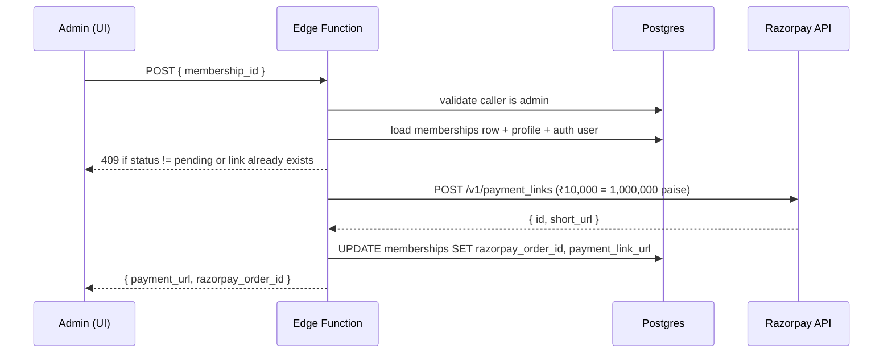

# Edge Functions Reference

Every edge function in the project, in detail. All four live under `supabase/functions/<name>/index.ts` and deploy automatically.

| Function | Purpose | Auth |
|---|---|---|
| `verify-doc-password` | Validate the `/documents` shared passphrase | None — public |
| `razorpay-create-payment-link` | Generate a Razorpay payment link for a pending membership | Admin only |
| `razorpay-webhook` | Receive `payment_link.paid` events and activate memberships | None — verified by signature |
| `promote-verification` | Move a profile's `verification_tier` forward (email → company → gst) | Authenticated user (self) |

All four have `verify_jwt = false` (the default in this project) and validate the JWT or signature **in code**.

> ⚠️ **Implementation status (May 2026):** `verify-doc-password` and `promote-verification` are live and fully functional. The two Razorpay functions are deployed and code-complete, but they read/write a `memberships` table whose migration has not yet been applied — so the payment flow will fail on first DB lookup until that migration ships. Treat them as "wired but dormant".

---

## `verify-doc-password`

**Endpoint** `POST /functions/v1/verify-doc-password`
**Body** `{ "password": string }` (1–200 chars)
**Response** `{ "ok": true | false }`
**Secret** `DOCS_PASSWORD` — value set in Supabase secrets (never documented in source).

Constant-time comparison protects against timing oracles. Returns 400 for malformed input, 500 if the secret is unset. The frontend `PasswordGate` component caches a successful result in `sessionStorage` and gates `/documents/*` accordingly.

---

## `razorpay-create-payment-link`

**Endpoint** `POST /functions/v1/razorpay-create-payment-link`
**Auth** Caller must have `app_role='admin'` — checked by reading `user_roles` with the service role after validating the bearer JWT.
**Body**
```json
{ "membership_id": "uuid", "expire_seconds": 1209600 }
```
**Response** `{ "payment_url": string, "razorpay_order_id": string }`
**Secrets** `RAZORPAY_KEY_ID`, `RAZORPAY_KEY_SECRET`, `APP_URL` (defaults to `https://mddma.in`).

### Flow



The payment link uses `notes.membership_id` so the webhook can find the row again. `callback_url` returns the user to `/account/verify?membership=<id>`.

### Failure modes

| Status | Cause |
|---|---|
| 401 | Missing or invalid auth header |
| 403 | Caller is not admin |
| 400 | `membership_id` missing, unknown tier |
| 404 | Membership not found |
| 409 | Membership not in `pending` state, or link already generated |
| 500 | `RAZORPAY_KEY_ID`/`SECRET` missing |
| 502 | Razorpay rejected the request — `detail` contains their JSON error |

---

## `razorpay-webhook`

**Endpoint** `POST /functions/v1/razorpay-webhook`
**Auth** None at the JWT layer. Signature verified using HMAC-SHA256 of the raw request body, with `RAZORPAY_WEBHOOK_SECRET`. The header is `x-razorpay-signature`.
**Events handled** `payment_link.paid`. All other events return 200 with `{ ok: true, ignored: <event> }` so Razorpay stops retrying.
**Secrets** `RAZORPAY_WEBHOOK_SECRET`.

### What it does on `payment_link.paid`

1. Reads `payload.payment_link.entity.notes.membership_id`
2. Calls `activate_membership(_membership_id, _payload)` RPC with:
   - `razorpay_payment_id`
   - `razorpay_order_id`
   - `amount_paid_inr` (paise → rupees)
3. The RPC flips status to `active`, sets `starts_at = now()`, `expires_at = now() + 1 year`, applies the 24-month `founding_lock_until`, and INSERTs `paid_member` (and `broker` if profile flagged) into `user_roles`. The `remove_free_when_upgraded` trigger then deletes the user's `free_member` row.

### Failure modes

| Status | Cause |
|---|---|
| 401 | Signature mismatch |
| 400 | Malformed JSON or missing `membership_id` |
| 500 | Webhook secret unset, or RPC error |

### Configure in Razorpay dashboard
Webhook URL: `https://<project-ref>.functions.supabase.co/razorpay-webhook`
Secret: same value as the `RAZORPAY_WEBHOOK_SECRET` Supabase secret.
Events: `payment_link.paid` (and optionally `payment_link.partially_paid`).

---

## `promote-verification`

**Endpoint** `POST /functions/v1/promote-verification`
**Auth** Bearer JWT — operates on the calling user's own profile only.
**Body** `{ "target": "email" | "company" | "gst", "company_name"?: string, "gstin"?: string }`
**Response** `{ "ok": true }` or `{ "error": string }`
**Secrets** None beyond Supabase service role.

### Tier ladder

```text
unverified → email → company → gst
```

Each step is one-way. The function refuses to demote and refuses to skip a step.

| Target | Requires | Validation |
|---|---|---|
| `email` | `auth.users.email_confirmed_at` not null | — |
| `company` | currently `email` | `company_name` length 2–120 |
| `gst` | currently `company` | `gstin` matches `^[0-9]{2}[A-Z]{5}[0-9]{4}[A-Z]{1}[1-9A-Z]{1}Z[0-9A-Z]{1}$` |

On success it writes the matching `*_verified_at` timestamp and sets `buyer_reputation_score` to `index(target) * 20 + (gst ? 20 : 0)` (so unverified=0, email=20, company=40, gst=80). The `prevent_profile_privilege_escalation` trigger normally blocks these field changes — this function uses the service role to bypass.

### Failure modes

| Status | Cause |
|---|---|
| 401 | No bearer token |
| 400 | Invalid target, email not confirmed, invalid company name, invalid GSTIN, attempting demotion |
| 404 | Profile row missing |
| 500 | Service role write failed |

---

## Invoking from the frontend

```ts
import { supabase } from "@/integrations/supabase/client";

// password gate
const { data } = await supabase.functions.invoke("verify-doc-password", {
  body: { password: input },
});

// admin generates a payment link (uses caller's bearer token automatically)
const { data, error } = await supabase.functions.invoke(
  "razorpay-create-payment-link",
  { body: { membership_id } },
);
```

Never call functions by path. Always use `supabase.functions.invoke()`.

## Logs & debugging

Edge function logs stream into Lovable Cloud and are accessible from the project's Cloud panel. Common patterns:

- **`razorpay-webhook: signature mismatch`** — wrong `RAZORPAY_WEBHOOK_SECRET`, or Razorpay was configured to send to a different URL. Compare the dashboard webhook secret with the Supabase secret.
- **`activate_membership failed`** — usually a unique-constraint clash on `user_roles`. The trigger handles it via `ON CONFLICT DO NOTHING`; if you see this, inspect the `_payload` for malformed JSON.
- **`Razorpay rejected the request`** — most common cause is a phone number missing the `+91` prefix.
