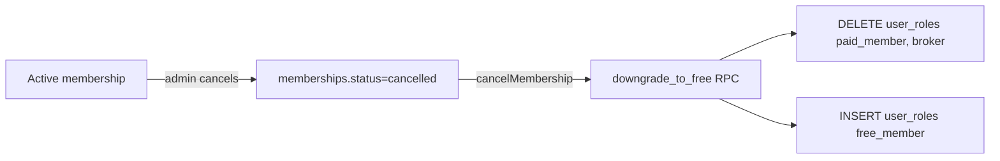
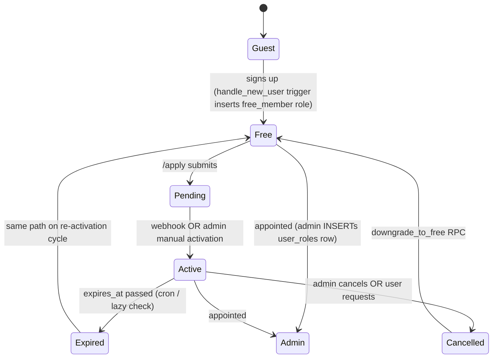

# Money & Membership

Pricing, the Razorpay flow end-to-end, KYC tiers, and the membership state machine. The single doc that answers "how does money turn into a role grant".

## Pricing matrix

| Tier | Annual fee | Roles granted | Capabilities |
|---|---|---|---|
| Guest | ₹0 | none | Browse public pages, read circulars, read forum |
| Free | ₹0 | `free_member` | + Post in forum, submit `/apply`, request verification |
| Paid | ₹10,000 | `paid_member` | + Send/receive RFQs, public storefront, products & variants, verification badge, full contact reveal |
| Broker (flag) | ₹10,000 | `paid_member` + `is_broker=true` | + Listed on `/broker` |
| Admin | — | `admin` | + CMS, moderation, verification toggle. Founder admin (`admin@mddma.org`) bypasses paid + KYC checks. |

There is **no** Silver/Gold/Platinum (BIZ-002), and **no** separate broker price (BIZ-003).

> ⚠️ **Implementation status (May 2026):** Tiers, role grants, the `downgrade_to_free` RPC, and the ROLE-001 trigger are all live in the database. The `memberships` table and the `activate_membership` RPC referenced below are **planned but not yet migrated** — the Razorpay edge functions are deployed and waiting for that schema. Until the migration ships, treat the payment flow as a contract spec, not a runnable path. Manual admin role grants (via `user_roles` insert) work today.

## End-to-end Razorpay flow

```mermaid
sequenceDiagram
  participant U as User
  participant App as Frontend
  participant DB as Postgres
  participant Admin as Admin (UI)
  participant EF1 as create-payment-link
  participant RZ as Razorpay
  participant EF2 as razorpay-webhook
  participant Trg as user_roles trigger

  U->>App: /apply (signed in, "I operate as a broker"?)
  App->>DB: INSERT memberships (status=pending, tier='paid')
  App->>DB: UPDATE profiles SET is_broker = ? (if checked)
  Admin->>EF1: invoke({ membership_id })
  EF1->>RZ: POST /payment_links (₹10,000)
  RZ-->>EF1: { id, short_url }
  EF1->>DB: UPDATE memberships SET razorpay_order_id, payment_link_url
  Admin->>U: share short_url (WhatsApp / email)
  U->>RZ: pays
  RZ->>EF2: webhook payment_link.paid (HMAC signed)
  EF2->>DB: rpc activate_membership(_id, _payload)
  DB->>DB: status=active, starts_at=now, expires_at=+1y, founding_lock_until=+24mo
  DB->>DB: INSERT user_roles (paid_member); INSERT user_roles (broker) if flagged
  Trg->>DB: DELETE user_roles WHERE role='free_member' (ROLE-001)
  EF2-->>RZ: 200 OK
```

### Step-by-step

1. **Apply** — `/apply` is auth-required. The form has one plan ("Paid Membership ₹10,000/yr") and a single checkbox **"I operate as a broker"** that flips `profiles.is_broker`. Submitting calls `createPendingMembership(userId, "paid")` which inserts a `memberships` row with `status='pending'`.
2. **Admin generates payment link** — Admin opens `/account/moderation`, finds the pending row, clicks "Generate payment link". Frontend calls `createPaymentLinkForMembership(id)` which invokes the `razorpay-create-payment-link` edge function. The edge fn validates admin, calls Razorpay's `POST /v1/payment_links`, stores `id` + `short_url` on the membership row, and returns the URL.
3. **User pays** — Admin shares the short URL. User pays via UPI/card/netbanking.
4. **Webhook activates** — Razorpay calls `razorpay-webhook` with `event=payment_link.paid` and an HMAC signature. The function verifies the signature with `RAZORPAY_WEBHOOK_SECRET`, looks up `notes.membership_id`, and calls the `activate_membership` RPC.
5. **RPC flips state** — `activate_membership` (SECURITY DEFINER) sets:
   - `status = 'active'`
   - `starts_at = now()`
   - `expires_at = now() + interval '1 year'`
   - `founding_lock_until = now() + interval '24 months'`
   - `price_paid_inr` from the webhook payload
   - INSERT `user_roles` (`paid_member`)
   - INSERT `user_roles` (`broker`) if `profiles.is_broker = true`
6. **Trigger enforces ROLE-001** — `remove_free_when_upgraded` fires AFTER INSERT and deletes the user's `free_member` row.

## Manual override path

If a member pays offline (cheque, bank transfer), admin uses **"Mark active manually"** in `/account/moderation` which calls `manuallyActivateMembership(membershipId, amount, notes)`. This invokes the same `activate_membership` RPC with `razorpay_payment_id = null`. The audit trail still records who pressed the button via `notes`.

## Cancellation & downgrade



`cancelMembership(id)` first reads `profile_id` from the row, sets `status='cancelled'`, then calls `downgrade_to_free(_user_id)`. The RPC removes paid/broker rows and re-inserts `free_member`. Failure of the RPC does **not** roll back the cancellation — the next paid upgrade will re-enforce the invariant via the trigger.

## Founding-lock window

`founding_lock_until = now() + 24 months` is set on activation. UI surfaces this as "Founding member until <date>". Currently the lock is informational only — no functional gating depends on it. It exists so that, if the Association ever raises prices, founders can be carved out by querying `founding_lock_until > now()`.

## KYC verification ladder

Independent from membership, but feeds the buyer reputation score.

```text
unverified  →  email  →  company  →  gst
   0           20         40          80
```

(Numbers on the right are `buyer_reputation_score` after each step.)

| Tier | What gets checked | Where |
|---|---|---|
| `unverified` | nothing | default on signup |
| `email` | `auth.users.email_confirmed_at` not null | `promote-verification` target=`email` |
| `company` | `company_name` length 2–120 | `promote-verification` target=`company` |
| `gst` | GSTIN matches the 15-char regex | `promote-verification` target=`gst` |

Each call to `promote-verification` writes the appropriate `*_verified_at` timestamp and recomputes the reputation score. Demotion is impossible (the function refuses).

`get_buyer_reputation_tier(score)` maps the score to a label:

| Score | Tier label |
|---|---|
| ≥ 80 | trusted |
| ≥ 50 | established |
| ≥ 20 | emerging |
| < 20 | new |

## Membership state machine



## ROLE-001 invariant

> A user has **either** `free_member` **or** `paid_member`/`broker`, never both.

Enforced at three layers:

1. **DB trigger** — `remove_free_when_upgraded` AFTER INSERT on `user_roles`.
2. **Cancellation RPC** — `downgrade_to_free` is the only sanctioned path back to free.
3. **Frontend invariant** — `RoleContext` asserts in dev mode that `permissions(paid_member) ⊇ permissions(free_member)`.

## What this gives a Paid member, in code

| Capability | Where it's checked |
|---|---|
| Submit RFQ | `CartContext.submit()` requires `effectiveRole >= paid_member`; RLS on `rfqs` enforces server-side via `auth.uid() = buyer_id` |
| Have a storefront | `/store/:slug` 404s if owning company has no `paid_member`-active member; RLS allows insert into `companies` only when `auth.uid() = owner_id` |
| Manage products + variants | RLS: only company owner OR admin |
| Full contact reveal | UI reveals `company.phone` only when `effectiveRole >= paid_member` |
| Listed on `/broker` | `profiles.is_broker = true` AND `paid_member` role active |

## Common edge cases

- **User cancels then re-applies** — `cancelMembership` sets status to `cancelled`, then `downgrade_to_free` restores `free_member`. The user can submit `/apply` again, which creates a new `memberships` row.
- **Webhook arrives twice** — `activate_membership` is idempotent at the role layer (`ON CONFLICT DO NOTHING` on `user_roles`), but the membership row's `starts_at` is set every call. Acceptable; the value won't drift in practice because Razorpay sends `payment_link.paid` exactly once per link.
- **User is admin** — `isFounderAdmin(roles)` short-circuits paid checks. Admin sees full contact reveal, can submit RFQs, can manage any company.
- **Legacy tier values** — `tierLabel('broker')` and `tierLabel('importer')` both return "Paid Membership"; `tierPriceInr` returns 10,000. Old rows do not need a backfill.
