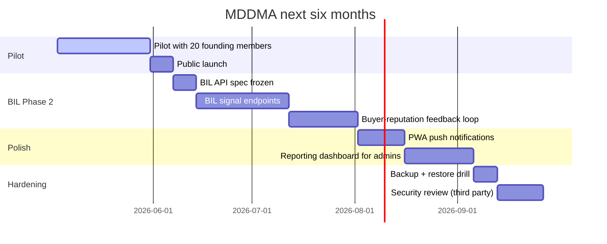

# Roadmap & Glossary

Phase-2 BIL contract, the next 6 months of work, the rejected-ideas graveyard, and the full glossary of trade and platform terms.

## Roadmap



The Phase 2 BIL is the largest single piece of work — it converts the existing `demand_score`, `trend_direction`, and `priority_score` fields from manual seeds into computed signals.

## Behavioral Intelligence Layer — contract

BIL lives outside Lovable Cloud (TECH-001). The frontend talks to it over HTTPS using `BIL_API_URL`.

### Endpoints (proposed v1)

```text
GET  /signals/products?ids=<uuid,uuid,...>
GET  /signals/companies?ids=<uuid,uuid,...>
POST /signals/events           # frontend posts view/click/RFQ-submit events
GET  /signals/buyer/:user_id   # current buyer reputation breakdown
```

### `GET /signals/products` response shape

```json
{
  "signals": [
    {
      "product_id": "uuid",
      "demand_score": 0,
      "trend_direction": "rising | stable | cooling",
      "stock_band": "high | medium | low",
      "rank_in_category": 0,
      "computed_at": "iso8601"
    }
  ]
}
```

### `POST /signals/events` body

```json
{
  "user_id": "uuid|null",
  "session_id": "string",
  "events": [
    { "type": "product_view", "product_id": "uuid", "ts": "iso8601" },
    { "type": "rfq_submit", "rfq_id": "uuid", "ts": "iso8601" }
  ]
}
```

### Authentication

JWT bearer (Supabase access token) for user-scoped reads; HMAC-signed shared secret for server-to-server (`BIL_INGEST_SECRET`).

### Fallback behaviour

If `BIL_API_URL` is unset or the API returns 5xx, the frontend reads the manually-seeded values from the `products` table (`demand_score`, `trend_direction`, `stock_band`). UI is identical; only the source changes. This is what makes the pilot work without BIL deployed.

### Cache & SLA targets

| Endpoint | Cache | SLA |
|---|---|---|
| `GET /signals/products` | 60s edge cache | p95 < 200ms |
| `GET /signals/companies` | 60s | p95 < 200ms |
| `POST /signals/events` | none, fire-and-forget | p95 < 100ms ack |
| `GET /signals/buyer/:id` | 5min | p95 < 300ms |

## Rejected ideas (graveyard)

Do not re-pitch these without a written reason that defeats the original objection. See `decisions-log` for the full ID-versioned record.

| Idea | Why rejected |
|---|---|
| Lead Packs (BIZ-001) | Conflicts with Association trust model |
| Silver / Gold / Platinum tiers (BIZ-002) | Decision fatigue, no revenue lift |
| Separate ₹5,000 broker addon (BIZ-003) | Operationally messy; flag is enough |
| Public price comparison (UX-001) | Erodes member margins |
| Anonymous RFQs (UX-002) | Reputation requires identity |
| WhatsApp Business API (TECH-003) | Cost + compliance; `wa.me` suffices |
| BIL inside edge functions (TECH-001) | Cold-start + scale issues |
| In-platform escrow | Trade settlement stays bank-to-bank |
| Native mobile apps | PWA install covers the use case |
| Storing roles on `profiles` | Privilege escalation risk; roles live in `user_roles` |

## Glossary

### Trade terms

| Term | Meaning |
|---|---|
| **Lot** | A discrete shipment of a commodity, usually one container or one bagged batch. |
| **Origin** | Country / region where the commodity was grown or processed. Iran, Afghanistan, Saudi Arabia, USA, Chile, etc. |
| **Grade** | Quality classification (e.g. Mamra, Sanora, California Nonpareil). Variant-level. |
| **Variant** | A specific grade + packaging combination of a product. |
| **MOQ** | Minimum Order Quantity — the smallest amount a seller will accept for an RFQ. |
| **GSTIN** | 15-character India tax ID. Validated regex `^[0-9]{2}[A-Z]{5}[0-9]{4}[A-Z]{1}[1-9A-Z]{1}Z[0-9A-Z]{1}$`. |
| **APMC** | Agricultural Produce Market Committee — physical mandi structure that MDDMA digitally complements. |
| **Mandi** | Wholesale physical market. |
| **Importer** | Member who brings supply into India, typically through Mumbai port. |
| **Wholesaler** | Member who buys in bulk from importers and resells to retailers. |
| **Broker** | Member who matches supply and demand without taking ownership. Flag, not a price. |

### Platform terms

| Term | Meaning |
|---|---|
| **Controlled transparency** | The thesis that platform shows enough to enable trade and hides enough to preserve margin. UX-001. |
| **Stock band** | High / Medium / Low — never raw stock count. |
| **Demand trend** | Rising / Stable / Cooling — never raw search count. |
| **Range price** | `₹X–₹Y/unit` — the only legal price render. |
| **RFQ** | Request For Quotation. The platform's core artifact. Auth-required, persistent, multi-item. |
| **RFQ cart** | Multi-item RFQ in progress. FAB + drawer UI. Drafts auto-save to `localStorage`. |
| **Cart drawer** | Side panel that lists cart items and the submit button. |
| **Buyer reputation tier** | One of `new`, `emerging`, `established`, `trusted`, derived from `buyer_reputation_score`. |
| **Verification tier** | KYC ladder: `unverified` → `email` → `company` → `gst`. |
| **Founder admin** | `admin@mddma.org` — bypasses paid + KYC checks. |
| **Founding lock** | 24-month price-and-tier guarantee on the first paid signup. |
| **Role simulator** | Header dropdown that lets you preview the site as any role. Demo only — no server-side effect. |
| **Live discovery** | Directory / Storefront / Products read live DB rows. Sample data is preserved for tests but not merged into production lists (see DATA-001 in `decisions-log`). |
| **Live ticker** | Global scrolling band at the top of the page showing `commodity range ±%` from priced products. |
| **`<GuardedPrice>`** | Single component that renders price ranges. Refuses raw values. |
| **BIL** | Behavioral Intelligence Layer — the external API. |
| **BIL signal** | Any one of: `demand_score`, `trend_direction`, `stock_band`, `rank_in_category`. |
| **wa.me deeplink** | A `https://wa.me/<phone>?text=...` URL that opens WhatsApp with a prefilled message. |

### Acronyms

| | |
|---|---|
| MDDMA | Mumbai Dry-fruits & Dates Merchants Association |
| BIL | Behavioral Intelligence Layer |
| RFQ | Request For Quotation |
| RBAC | Role-Based Access Control |
| RLS | Row-Level Security |
| RPC | Remote Procedure Call (Postgres function exposed via PostgREST) |
| PWA | Progressive Web App |
| KYC | Know Your Customer |
| GSTIN | Goods & Services Tax Identification Number |
| MOQ | Minimum Order Quantity |
| FAB | Floating Action Button |
| HSL | Hue / Saturation / Lightness (color model) |
| SDK | Software Development Kit |
| HMAC | Hash-based Message Authentication Code |
| UPI | Unified Payments Interface |
