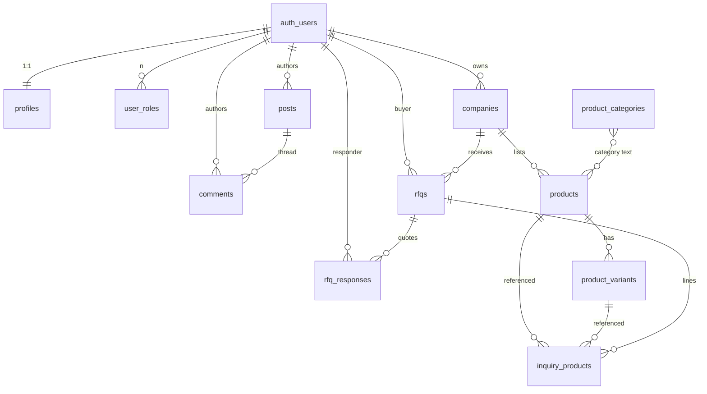

# Database Reference

The exhaustive ground-truth schema. Every table, every column, every RLS policy, every function, every enum. If the database vanished tomorrow, this doc plus the migrations folder is enough to rebuild it.

> **Backend** Lovable Cloud (Postgres + Auth + Storage + Edge Functions). All access is gated by Row-Level Security. There are no public tables — every read is filtered by an RLS policy.

## Entity-relationship diagram

`auth.users` is owned by Supabase Auth and is **never** referenced by foreign key from app tables — relations are by `uuid` only. App-level joins use `LEFT JOIN auth.users` only inside service-role edge functions.

## Enums

| Enum | Values |
|---|---|
| `app_role` | `admin`, `broker`, `paid_member`, `free_member` |
| `review_status` | `pending`, `approved`, `rejected` |
| `verification_tier` | `unverified`, `email`, `company`, `gst` |
| `stock_band` | `high`, `medium`, `low` |
| `trend_direction` | `rising`, `stable`, `cooling` |
| `rfq_status` | `new`, `quoted`, `negotiating`, `closed`, `expired` |
| `membership_tier` (text, not enum) | `paid` (legacy: `broker`/`trader`/`importer` collapse to `paid`) |
| `membership_status` (text, not enum) | `pending`, `active`, `expired`, `cancelled` |

## Tables — full reference

### `profiles`
One row per authenticated user. Created automatically by the `handle_new_user` trigger on `auth.users` insert.

| Column | Type | Default | Notes |
|---|---|---|---|
| `id` | uuid PK | — | Mirrors `auth.users.id` |
| `full_name` | text | null | From OAuth metadata |
| `phone` | text | null | E.164 preferred |
| `designation` | text | null | "Director", "Partner", etc. |
| `avatar_url` | text | null | OAuth picture or storage URL |
| `bio` | text | null | Short paragraph |
| `company_name` | text | null | Protected — only edge fn can set |
| `gstin` | text | null | Protected — validated against `^[0-9]{2}[A-Z]{5}[0-9]{4}[A-Z]{1}[1-9A-Z]{1}Z[0-9A-Z]{1}$` |
| `is_broker` | bool | `false` | Protected; flag, no separate price |
| `verification_tier` | enum | `unverified` | Protected; promoted by admin (service role) — there is **no** `promote-verification` edge function in the current build |
| `buyer_reputation_score` | int | `0` | Protected; 0–100, derived from tier |
| `rfq_count` | int | `0` | Protected; bumped server-side |
| `rfq_response_rate` | numeric | `0` | Protected |
| `email_verified_at` | timestamptz | null | Protected |
| `company_verified_at` | timestamptz | null | Protected |
| `gst_verified_at` | timestamptz | null | Protected |
| `created_at`, `updated_at` | timestamptz | `now()` | |

**RLS** — self or admin can SELECT / UPDATE; self can INSERT; nobody can DELETE.
**Trigger** `prevent_profile_privilege_escalation` (BEFORE UPDATE): non-admins cannot modify any of the 11 protected fields above. Admin updates via `/account/moderation` and the Razorpay activation path bypass via the `admin` role check.

### `user_roles`
The single source of truth for what a user can do. **Never** stored on `profiles`.

| Column | Type | Default |
|---|---|---|
| `id` | uuid PK | `gen_random_uuid()` |
| `user_id` | uuid (→ `auth.users`) | — |
| `role` | `app_role` enum | — |
| `created_at` | timestamptz | `now()` |

Unique constraint on `(user_id, role)`.

**RLS** — admins INSERT/DELETE; user or admin SELECT; nobody UPDATE.
**Trigger** `remove_free_when_upgraded` (AFTER INSERT): when a row with role `paid_member` or `broker` is inserted for a user, deletes their `free_member` row. Enforces the ROLE-001 invariant (paid and free are mutually exclusive). The `downgrade_to_free(uuid)` RPC reverses this.

### `companies`
One row per Paid member's storefront. A user can own at most one company in practice, enforced by application logic, not a unique constraint.

| Column | Type | Default | Notes |
|---|---|---|---|
| `id` | uuid PK | `gen_random_uuid()` | |
| `owner_id` | uuid | — | Must equal `auth.uid()` on insert |
| `name`, `slug` | text | — | Slug is the public URL handle |
| `tagline`, `description` | text | null | |
| `logo_url`, `cover_url` | text | null | Storage paths in `company-assets` bucket |
| `city`, `state` | text | null | |
| `country` | text | `'India'` | |
| `address` | text | null | |
| `email`, `phone`, `website` | text | null | |
| `gstin` | text | null | Validated client-side; promoted via verification flow |
| `established_year` | int | null | |
| `categories` | text[] | `{}` | Free-form tags; the chip "broker" is read by `dataSource.ts` |
| `certifications` | text[] | `{}` | FSSAI, ISO, etc. |
| `social_links` | jsonb | `{}` | `{ instagram, linkedin, ... }` |
| `is_verified` | bool | `false` | Toggled by admin |
| `is_hidden` | bool | `false` | Soft delete |
| `review_status` | `review_status` | `'approved'` | Pre-publication moderation |
| `rejection_reason` | text | null | Set when `review_status='rejected'` |
| `membership_tier` | text | `'free'` | Mirrors active membership for query convenience |
| `created_at`, `updated_at` | timestamptz | `now()` | |

**RLS** — public sees only `is_hidden=false AND review_status='approved'`; owner and admin see everything they own/all; INSERT requires `auth.uid()=owner_id`; UPDATE/DELETE owner or admin.

### `products`
Cross-member catalogue rows. Variants live in a separate table.

| Column | Type | Default | Notes |
|---|---|---|---|
| `id` | uuid PK | `gen_random_uuid()` | |
| `company_id` | uuid | — | Must reference a company you own |
| `name`, `slug` | text | — | Slug unique per company by convention |
| `category` | text | null | Matches `product_categories.slug` or `aliases` |
| `origin` | text | null | Country/region |
| `description` | text | null | |
| `image_url` | text | null | Cover image (storage `product-images` bucket) |
| `gallery` | text[] | `{}` | Up to 3 additional images — enforced by trigger |
| `video_url` | text | null | YouTube / Vimeo / mp4 URL |
| `unit` | text | `'kg'` | Display unit |
| `price_min`, `price_max` | numeric | null | **Never rendered exactly** — only as a range |
| `market_avg_price` | numeric | null | For BIL signal display |
| `stock_band` | enum | `'medium'` | UI shows High / Med / Low only |
| `trend_direction` | enum | `'stable'` | rising / stable / cooling |
| `demand_score` | int | `50` | 0–100, mapped to high/medium/low for UI |
| `packaging_options` | text[] | `{}` | "1kg pouch", "25kg sack", etc. |
| `certifications` | text[] | `{}` | |
| `is_featured`, `is_hidden` | bool | `false` | |
| `view_count`, `inquiry_count` | int | `0` | Bumped by app code |
| `created_at`, `updated_at` | timestamptz | `now()` | |

**Trigger** `enforce_product_gallery_limit`: rejects insert/update if `array_length(gallery, 1) > 3`.
**RLS** — public sees `is_hidden=false`; company owner and admin see all; mutation requires owning the parent company.

### `product_variants`
Variant-level pricing and stock. The RFQ cart points at a variant when one exists.

| Column | Type | Default |
|---|---|---|
| `id` | uuid PK | `gen_random_uuid()` |
| `product_id` | uuid | — |
| `sku` | text | null |
| `name` | text | — |
| `grade` | text | null |
| `packaging` | text | null |
| `moq`, `moq_unit` | numeric, text | null, `'kg'` |
| `price_min`, `price_max`, `price_unit` | numeric, numeric, text | null, null, `'kg'` |
| `stock_band` | enum | `'medium'` |
| `lead_time_days` | int | null |
| `certifications` | text[] | `{}` |
| `is_active` | bool | `true` |
| `sort_order` | int | `0` |
| `created_at`, `updated_at` | timestamptz | `now()` |

**RLS** — public sees `is_active=true`; product owner sees all; only the parent company's owner (or admin) can INSERT/UPDATE/DELETE.

### `product_categories`
Admin-curated category taxonomy. `aliases` lets multiple loose tags resolve to the same category.

| Column | Type | Default |
|---|---|---|
| `id` | uuid PK | `gen_random_uuid()` |
| `name`, `slug` | text | — |
| `description` | text | null |
| `image_url` | text | null |
| `aliases` | text[] | `{}` |
| `is_featured`, `is_active` | bool | `false`, `true` |
| `sort_order` | int | `0` |
| `created_at`, `updated_at` | timestamptz | `now()` |

**RLS** — public reads active categories; only admin mutates.

### `rfqs`
The buyer's request. Auth required (UX-002). Multi-item cart submits one `rfqs` row plus N `inquiry_products` rows.

| Column | Type | Default | Notes |
|---|---|---|---|
| `id` | uuid PK | `gen_random_uuid()` | |
| `buyer_id` | uuid | — | `auth.uid()` |
| `company_id` | uuid | — | Receiving seller |
| `product_id` | uuid | null | Single-item shorthand |
| `product_name` | text | — | Denormalised so deletes don't break audit |
| `quantity` | text | — | Free-form so units stay flexible |
| `delivery_location`, `delivery_timeline`, `packaging` | text | null | |
| `message` | text | null | |
| `buyer_name`, `buyer_email`, `buyer_phone`, `buyer_company` | text | null | Snapshotted at submit |
| `status` | `rfq_status` | `'new'` | Lifecycle: new → quoted → negotiating → closed/expired |
| `priority_score` | int | `0` | Derived from buyer reputation (Phase 2) |
| `created_at`, `updated_at` | timestamptz | `now()` | |

**RLS** — buyer, seller (via `companies.owner_id`), or admin SELECT; only buyer INSERT (`auth.uid()=buyer_id`); seller and admin UPDATE; nobody DELETE.

### `inquiry_products`
The lines of a multi-item RFQ.

| Column | Type | Default |
|---|---|---|
| `id` | uuid PK | `gen_random_uuid()` |
| `rfq_id` | uuid | — |
| `product_id` | uuid | null |
| `variant_id` | uuid | null |
| `product_name` | text | — |
| `quantity` | text | — |
| `notes` | text | null |
| `created_at` | timestamptz | `now()` |

**RLS** — view if you can view the parent `rfqs` row; INSERT only if you are the parent RFQ's buyer; no UPDATE / DELETE.

### `rfq_responses`
Seller quotes / negotiation messages.

| Column | Type | Default |
|---|---|---|
| `id` | uuid PK | `gen_random_uuid()` |
| `rfq_id` | uuid | — |
| `responder_id` | uuid | — |
| `price_quoted` | numeric | null |
| `unit` | text | `'kg'` |
| `valid_until` | date | null |
| `message` | text | null |
| `created_at` | timestamptz | `now()` |

**RLS** — buyer of RFQ, the responding seller, and admin SELECT; only the seller of the RFQ's company INSERT; no UPDATE / DELETE.

### `posts` and `comments`
Native forum.

`posts` — `id`, `author_id`, `title`, `body`, `category` (default `'Trade Discussions'`), `is_pinned`, `view_count`, timestamps.
`comments` — `id`, `post_id`, `author_id`, `body`, `created_at`.

**RLS** — both tables: public read; authenticated users INSERT (must own `author_id`); author or admin UPDATE/DELETE.

### `circulars`
Admin CMS — Association notices.

| Column | Type | Default |
|---|---|---|
| `id` | uuid PK | `gen_random_uuid()` |
| `title` | text | — |
| `body` | text | — |
| `category` | text | `'general'` |
| `is_published` | bool | `false` |
| `published_at` | timestamptz | null |
| `created_by` | uuid | — |
| `created_at`, `updated_at` | timestamptz | `now()` |

**RLS** — public reads `is_published=true`; only admin mutates and INSERT requires `created_by = auth.uid()`.

### `advertisements`
Admin CMS — placement-driven ads.

| Column | Type | Default |
|---|---|---|
| `id` | uuid PK | `gen_random_uuid()` |
| `title` | text | — |
| `image_url` | text | — |
| `link_url` | text | null |
| `placement` | text | `'homepage-banner'` |
| `start_date` | date | `CURRENT_DATE` |
| `end_date` | date | null |
| `is_active` | bool | `true` |
| `clicks`, `impressions` | int | `0` |
| `created_at`, `updated_at` | timestamptz | `now()` |

**RLS** — public reads active ads where `start_date <= today AND (end_date IS NULL OR end_date >= today)`; only admin mutates.

### `memberships` *(planned — not yet migrated)*

> ⚠️ **Implementation status:** This table is referenced by `razorpay-create-payment-link` and `razorpay-webhook` and by the planned RPCs below, but **the migration has not been applied yet**. Until it is, the Razorpay flow is wired end-to-end in code but will fail on the first DB lookup. Tracked under TECH-004 in the decisions log; ship the migration before flipping payments live.

Intended lifecycle: pending → active → expired/cancelled. Created when a user submits `/apply`; activated by Razorpay webhook or by admin override (`activate_membership` RPC, also planned).

Planned columns: `id`, `profile_id`, `tier` (text, default `'paid'`), `status` (text), `starts_at`, `expires_at`, `founding_lock_until`, `price_paid_inr`, `razorpay_payment_id`, `razorpay_order_id`, `payment_link_url`, `notes`, timestamps.

## Functions

| Function | Returns | Purpose |
|---|---|---|
| `has_role(_user_id uuid, _role app_role)` | bool | The single role-check used inside every RLS policy. `STABLE`, `SECURITY DEFINER`, `search_path=public` to avoid recursive RLS lookups. |
| `handle_new_user()` | trigger | On `auth.users` insert: creates a `profiles` row + a `user_roles` row (`admin` if email is `admin@mddma.org`, otherwise `free_member`). |
| `prevent_profile_privilege_escalation()` | trigger | BEFORE UPDATE on `profiles`. Blocks non-admins from changing any protected trust field. |
| `enforce_product_gallery_limit()` | trigger | Caps `products.gallery` at 3 items. |
| `update_updated_at_column()` | trigger | Generic `NEW.updated_at = now()` BEFORE UPDATE; attached to every table that has an `updated_at`. |
| `remove_free_when_upgraded()` | trigger | AFTER INSERT on `user_roles`. Enforces ROLE-001: deletes `free_member` row when a user gains `paid_member` or `broker`. |
| `downgrade_to_free(_user_id uuid)` | void | RPC. Removes `paid_member`/`broker` rows and re-inserts `free_member`. Used by `cancelMembership`. |
| `get_buyer_reputation_tier(_score int)` | text | Pure mapping: ≥80 trusted, ≥50 established, ≥20 emerging, else new. |
| `activate_membership(_membership_id uuid, _payload jsonb)` *(planned)* | uuid | SECURITY DEFINER. Flips a pending membership to active, applies the founding-lock window, grants `paid_member` (and `broker` if flagged), seeds `expires_at`. **Not yet created** — ships with the `memberships` migration. |

## Storage buckets

| Bucket | Public | Used by |
|---|:-:|---|
| `avatars` | yes | `profiles.avatar_url` |
| `company-assets` | yes | `companies.logo_url`, `companies.cover_url` |
| `product-images` | yes | `products.image_url`, `products.gallery` |
| `ad-assets` | yes | `advertisements.image_url`. **Write requires admin.** |

Bucket policies live in `supabase/migrations/*` — folder-scoping by `(storage.foldername(name))[1] = auth.uid()::text` is the convention for any future user-scoped bucket.

## Indexes worth knowing

- `companies(slug)` — directory and storefront resolve by slug
- `products(slug)`, `products(company_id)`, `products(category)` — listing pages
- `product_variants(product_id)` — variant manager
- `rfqs(buyer_id)`, `rfqs(company_id)` — RFQ inbox tabs
- `posts(category, is_pinned, created_at desc)` — forum sort
- `user_roles(user_id, role)` — UNIQUE; `has_role` uses it directly
