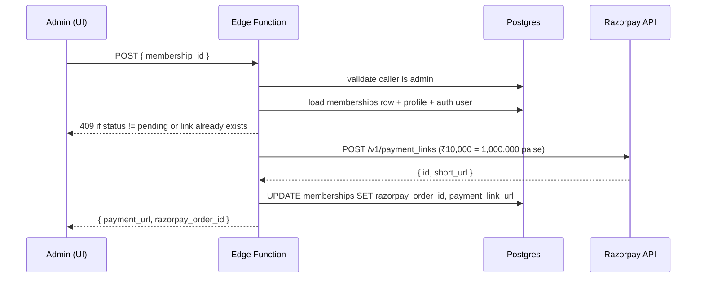

# Edge Functions Reference

Every edge function actually deployed in the project, in detail. All four live under `supabase/functions/<name>/index.ts` and deploy automatically when you save changes.

| Function | Purpose | Auth |
|---|---|---|
| `verify-doc-password` | Validate the `/documents` shared passphrase | None — public, constant-time secret compare |
| `get-internal-doc` | Return markdown for password-gated internal docs (07–17) | None at JWT layer; password verified per request |
| `razorpay-create-payment-link` | Generate a Razorpay payment link for a pending membership | Bearer JWT; admin role required |
| `razorpay-webhook` | Receive `payment_link.paid` events and activate memberships | None at JWT layer; HMAC signature verified |

All four have `verify_jwt = false` (the project default) and validate the JWT or signature **in code** — never trust the gateway alone.

> ⚠️ **Implementation status (May 2026):** `verify-doc-password` and `get-internal-doc` are live and load-bearing — the entire `/documents` hub depends on them. The two Razorpay functions are deployed and code-complete, but they read/write a `memberships` table whose migration has not yet been applied. Until that schema ships, they will fail on first DB lookup. Treat them as "wired but dormant"; manual role grants via `INSERT INTO user_roles` work today.

---

## `verify-doc-password`

**Endpoint** `POST /functions/v1/verify-doc-password`
**Body** `{ "password": string }` (1–200 chars)
**Response** `{ "ok": true | false }`
**Secret** `DOCS_PASSWORD` — value set in Supabase secrets (never documented in source).

Constant-time comparison protects against timing oracles. Returns 400 for malformed input, 500 if the secret is unset. The frontend `PasswordGate` component caches a successful result in `sessionStorage` and gates `/documents/*` accordingly.

```ts
const { data } = await supabase.functions.invoke("verify-doc-password", {
  body: { password: input },
});
if (data?.ok) sessionStorage.setItem("docs-pw-ok", "1");
```

---

## `get-internal-doc`

**Endpoint** `POST /functions/v1/get-internal-doc`
**Body** `{ "password": string, "slug"?: string }`
**Response** `{ "ok": true, "slug": string, "source": string }` or `{ "ok": true, "slugs": string[] }` if no slug
**Secret** `DOCS_PASSWORD` (same as above)

Internal markdown bodies (docs 07–17) live next to the function under `./content/<NN-slug>.md` and are **never** bundled into the client. The function validates the password, looks up the slug in `SLUG_TO_FILE`, reads the file, and returns the body inline.

| Slug | File |
|---|---|
| `database-reference` | `07-database-reference.md` |
| `edge-functions-reference` | `08-edge-functions-reference.md` |
| `frontend-architecture` | `09-frontend-architecture.md` |
| `component-and-design` | `10-component-and-design.md` |
| `decisions-log` | `11-decisions-log.md` |
| `money-and-membership` | `12-money-and-membership.md` |
| `operations-runbook` | `13-operations-runbook.md` |
| `roadmap-and-glossary` | `14-roadmap-and-glossary.md` |
| `security-and-rls` | `15-security-and-rls.md` |
| `storage-and-media` | `16-storage-and-media.md` |
| `owner-quickstart` | `17-owner-quickstart.md` |

### Failure modes

| Status | Cause |
|---|---|
| 400 | Missing/oversized password |
| 401 | Password mismatch |
| 404 | Unknown slug |
| 500 | Server error reading the markdown file |

**To add a new internal doc:** drop the `.md` in `supabase/functions/get-internal-doc/content/`, add an entry to `SLUG_TO_FILE` in `index.ts`, and add a `DocMeta` row with `internal: true` to `src/content/docs/_meta.ts`. No body import is needed in the client bundle.

---

## `razorpay-create-payment-link`

**Endpoint** `POST /functions/v1/razorpay-create-payment-link`
**Auth** Caller must have `app_role='admin'` — checked by reading `user_roles` with the service role after validating the bearer JWT.
**Body**
```json
{ "membership_id": "uuid", "expire_seconds": 1209600 }
```
**Response** `{ "payment_url": string, "razorpay_order_id": string }`
**Secrets** `RAZORPAY_KEY_ID`, `RAZORPAY_KEY_SECRET`, `APP_URL` (defaults to `https://mddma.in`).

### Flow



The payment link uses `notes.membership_id` so the webhook can find the row again. `callback_url` returns the user to `/account/profile?membership=<id>` (the legacy `/account/verify` URL was removed; update the edge function's `callback_url` if you re-introduce a verification page).

### Pricing

`TIER_PRICE_INR` collapses every legacy tier (`paid`, `broker`, `trader`, `importer`) to **₹10,000**. Per BIZ-002 / BIZ-003, the broker addon doesn't exist — `is_broker` is just a flag set on `profiles`.

### Failure modes

| Status | Cause |
|---|---|
| 401 | Missing or invalid auth header |
| 403 | Caller is not admin |
| 400 | `membership_id` missing, unknown tier |
| 404 | Membership not found |
| 409 | Membership not in `pending` state, or link already generated |
| 500 | `RAZORPAY_KEY_ID`/`SECRET` missing |
| 502 | Razorpay rejected the request — `detail` contains their JSON error |

---

## `razorpay-webhook`

**Endpoint** `POST /functions/v1/razorpay-webhook`
**Auth** None at the JWT layer. Signature verified using HMAC-SHA256 of the raw request body, with `RAZORPAY_WEBHOOK_SECRET`. The header is `x-razorpay-signature`.
**Events handled** `payment_link.paid`. All other events return 200 with `{ ok: true, ignored: <event> }` so Razorpay stops retrying.
**Secrets** `RAZORPAY_WEBHOOK_SECRET`.

### What it does on `payment_link.paid`

1. Reads `payload.payment_link.entity.notes.membership_id`
2. Calls `activate_membership(_membership_id, _payload)` RPC with:
   - `razorpay_payment_id`
   - `razorpay_order_id`
   - `amount_paid_inr` (paise → rupees)
3. The RPC flips status to `active`, sets `starts_at = now()`, `expires_at = now() + 1 year`, applies the 24-month `founding_lock_until`, and INSERTs `paid_member` (and `broker` if profile flagged) into `user_roles`. The `remove_free_when_upgraded` trigger then deletes the user's `free_member` row (ROLE-001).

### Failure modes

| Status | Cause |
|---|---|
| 401 | Signature mismatch |
| 400 | Malformed JSON or missing `membership_id` |
| 500 | Webhook secret unset, or RPC error |

### Configure in Razorpay dashboard
Webhook URL: `https://<project-ref>.functions.supabase.co/razorpay-webhook`
Secret: same value as the `RAZORPAY_WEBHOOK_SECRET` Supabase secret.
Events: `payment_link.paid` (and optionally `payment_link.partially_paid`).

---

## Functions intentionally NOT in the project

| Name | Why not |
|---|---|
| `promote-verification` | KYC tier promotion is handled by admins via `/account/moderation` (service-role writes). Earlier docs referred to a self-serve edge function; that path was never shipped. |
| BIL inference functions | Behavioral Intelligence Layer is an external API (TECH-001), not Supabase edge functions. |
| WhatsApp messaging functions | We use `wa.me` deeplinks only (TECH-003). |

---

## Invoking from the frontend

```ts
import { supabase } from "@/integrations/supabase/client";

// password gate
const { data } = await supabase.functions.invoke("verify-doc-password", {
  body: { password: input },
});

// internal doc (after gate)
const { data: doc } = await supabase.functions.invoke("get-internal-doc", {
  body: { password: cachedPw, slug: "decisions-log" },
});

// admin generates a payment link (uses caller's bearer token automatically)
const { data, error } = await supabase.functions.invoke(
  "razorpay-create-payment-link",
  { body: { membership_id } },
);
```

Never call functions by path. Always use `supabase.functions.invoke()`.

## Logs & debugging

Edge function logs stream into Lovable Cloud and are accessible from the project's Cloud panel. Common patterns:

- **`razorpay-webhook: signature mismatch`** — wrong `RAZORPAY_WEBHOOK_SECRET`, or Razorpay was configured to send to a different URL.
- **`activate_membership failed`** — usually a unique-constraint clash on `user_roles`. The trigger handles it via `ON CONFLICT DO NOTHING`; if you see this, inspect the `_payload` for malformed JSON.
- **`Razorpay rejected the request`** — most common cause is a phone number missing the `+91` prefix.
- **`get-internal-doc: Unknown slug`** — slug missing from `SLUG_TO_FILE`. Re-deploy after adding it.
