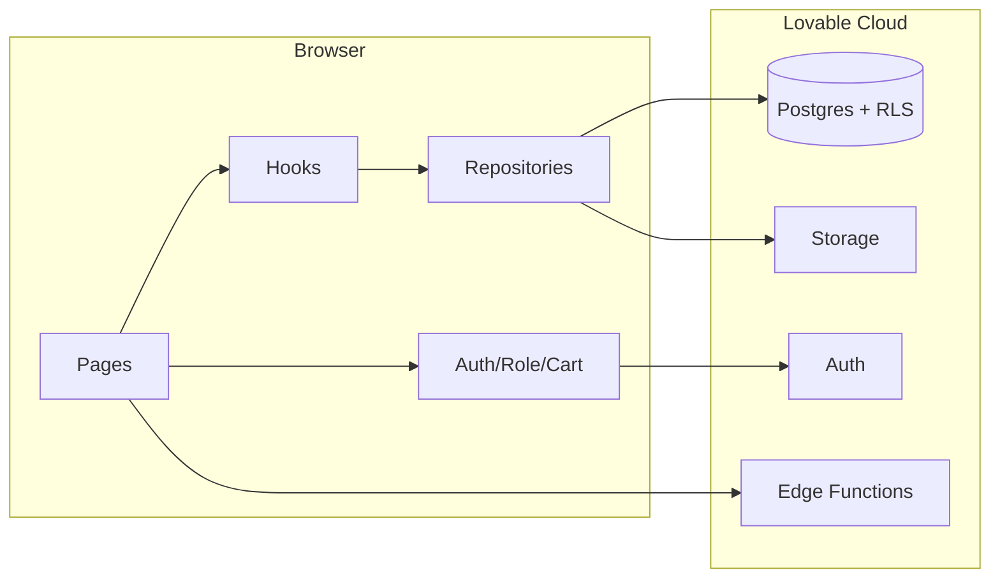

# Frontend Architecture


> **v3.1.3 Removal Notice (June 2026)** — The **RFQ engine, multi-item RFQ cart, `rfqs` / `inquiry_products` tables, /account/rfqs inbox, RFQ-related edge functions, and the /forms Verification Request** flow have all been **removed from the product**. Any section below that references RFQs, RFQ cart, RFQ inbox, `rfqs` / `inquiry_products`, or the /forms verification form is **historical only** and does not reflect the live app. The mobile bottom tab now opens the Member Dashboard from the Account tab, and Circulars / Members positions in the bottom tab bar have been swapped.

---


Routes, contexts, hooks, repositories, and the merge layer. The complete frontend mental model in one doc.

## Provider tree

```text
TooltipProvider
└─ BrowserRouter
   └─ AuthProvider          (Supabase session + signIn/signOut)
      └─ RoleProvider       (resolves roles, simulator, helpers)
         └─ CartProvider    (RFQ cart with localStorage drafts)
            └─ DocAuthProvider  (gates /documents)
               ├─ Toaster + Sonner + CartFab + CartDrawer
               └─ <Routes>
```

Order matters: `RoleProvider` reads `useAuth`; `CartProvider` reads `useRole` to decide where the "Submit" button leads. Never re-order.

## Routes

The full route table from `src/App.tsx`. Every protected route wraps its element in `<ProtectedRoute>`; admin-only routes pass `requireRole="admin"`.

| Path | Component | Gate |
|---|---|---|
| `/` | `Index` | public |
| `/about` | `About` | public |
| `/directory` | `Directory` | public |
| `/directory/:slug` | `MemberProfile` | public |
| `/store/:slug` | `Storefront` | public (404-style empty if not Paid) |
| `/products` | `Products` | public |
| `/products/:slug` | `ProductPage` | public |
| `/broker` | `Broker` | public (filters by `is_broker`) |
| `/market` | `Market` | public |
| `/dashboard` | `Dashboard` | public (read-only widgets) |
| `/community` | `Community` | public read; auth required to post |
| `/membership` | `MembershipPlans` | public |
| `/circulars` | `Circulars` | public |
| `/forms`, `/contact` | `Forms` | public |
| `/login` | `Login` | public |
| `/apply` | `Apply` | public (auth gate inside) |
| `/admin` | redirect → `/account/moderation` | — |
| `/account/profile` | `ProfilePage` | authenticated |
| `/account/company` | `CompanyPage` | authenticated |
| `/account/products` | `ProductsPage` | authenticated |
| `/account/brands` | `BrandsPage` (account/) | authenticated |
| `/account/rfqs` | `RFQInbox` | authenticated |
| `/account/moderation` | `AdminModeration` | admin |
| `/documents` | `DocumentsHub` | password-gated |
| `/documents/:slug` | `DocViewer` | password-gated |
| `/pitch`, `/mvp-canvas`, `/brd`, `/sow`, `/prd`, `/fsd`, `/sdd`, `/tsd`, `/changelog` | redirects to `/documents/*` | — |
| `*` | `NotFound` | — |

There is **no `/account/verify`** route. KYC tier promotion is done by admins from `/account/moderation` (the `prevent_profile_privilege_escalation` trigger blocks any other path).

### `ProtectedRoute`
Reads `useAuth` and `useRole`. If no session, redirects to `/login` preserving the return URL. If `requireRole` is set and the user doesn't have it (effective role, simulator-aware), redirects to `/`.

## Contexts

### `AuthContext` (`src/contexts/AuthContext.tsx`)
Wraps Supabase Auth. Exports `{ session, user, isLoading, signIn, signOut, signInWithGoogle }`. The session subscription is **synchronous** inside `onAuthStateChange` (never `await` inside the callback — known Supabase footgun) and only does async work in a follow-up `setTimeout(..., 0)`.

### `RoleContext` (`src/contexts/RoleContext.tsx`)
Reads `user_roles` for the signed-in user, plus the **role simulator** value from `localStorage`. Exports:
- `roles: AppRole[]` — actual roles from the DB
- `simulatedRole: AppRole | null` — overrides for demos
- `effectiveRole` — what the UI should treat them as
- `is(role)` / `isAtLeast(role)` — permission helpers
- A dev-mode invariant assertion that `paid_member` permissions are a strict superset of `free_member`.

Permission ladder (read top-to-bottom; each row inherits everything above):

```text
guest      → browse public pages
free_member→ + post in forum, /apply
paid_member→ + RFQ send/receive, storefront, products+variants, full contact reveal
broker     → + listed on /broker
admin      → + CMS (circulars, ads), member moderation, verification toggle
```

### `CartContext` (`src/contexts/CartContext.tsx`)
The multi-item RFQ cart. Persists drafts in `localStorage` keyed by browser, merges into the user's account on first authenticated submit. Exports `{ items, add, update, remove, clear, submit }`. `submit()` requires Paid status and inserts one `rfqs` row + N `inquiry_products` rows in a single transaction (best-effort; the inserts are sequential because Postgres auto-rollbacks on RLS denial).

### `DocAuthProvider` / `PasswordGate`
Calls `verify-doc-password`, caches `ok=true` in `sessionStorage`. Wraps `/documents` and `/documents/:slug`.

## Hooks → Repositories → Supabase

The strict three-layer pattern. Pages **never** call `supabase.from()` directly.

```text
Page (e.g. Directory.tsx)
  ↓ imports
Hook (e.g. useCompanies)
  ↓ calls
Repository (e.g. repositories/companies.ts)
  ↓ calls
supabase.from("companies").select(...)
```

### Worked example: directory page

```ts
// src/hooks/queries/useCompanies.ts
export function useCompanies() {
  const [data, setData] = useState<CompanyRow[]>([]);
  // ...calls listCompanies() from the repository
}

// src/repositories/companies.ts
export async function listCompanies(): Promise<CompanyRow[]> {
  const { data } = await supabase
    .from("companies")
    .select("*")
    .eq("is_hidden", false)
    .eq("review_status", "approved");
  return data ?? [];
}

// src/pages/Directory.tsx
const { data: companies } = useCompanies();
const entries = mergeDirectory(companies); // dataSource.ts
```

This split is what stopped the "KGVPL invisible" class of bugs: there is exactly one place a discovery list is built.

### Repositories index

| File | Owns |
|---|---|
| `repositories/companies.ts` | `companies` table |
| `repositories/products.ts` | `products` + `product_variants` |
| `repositories/productCategories.ts` | `product_categories` |
| `repositories/circulars.ts` | `circulars` |
| `repositories/advertisements.ts` | `advertisements` |
| `repositories/posts.ts` | `posts` + `comments` |

### Hooks index

| File | Wraps |
|---|---|
| `hooks/queries/useCompanies.ts` | `listCompanies` |
| `hooks/queries/useProducts.ts` | `listProducts`, `getProductBySlug`, `listVariants` |
| `hooks/queries/useProductCategories.ts` | `listProductCategories` |
| `hooks/queries/useContent.ts` | `useCirculars`, `useAds`, `usePosts` |
| `hooks/useLiveCompanies.ts` | Realtime subscription on `companies` |

## `lib/dataSource.ts` — the merge layer

Live database rows are mapped to UI-shape entries (`DirectoryEntry`, `ProductEntry`). Each entry carries `source: "live" | "demo"`. Sample data is no longer merged in — `mergeDirectory(live)` and `mergeProducts(live)` simply project DB rows. Sample fallbacks remain in `src/data/sampleData.ts` and `src/data/productListings.ts` for tests and offline previews but are not rendered in production paths.

The naming is preserved (`mergeDirectory`, `mergeProducts`) so older imports keep working.

## `lib/membership.ts` — money & accessors

Single Paid plan at ₹10,000. Legacy DB rows (`broker`, `trader`, `importer`) flow through `tierLabel()` / `tierPriceInr()` and resolve to "Paid Membership" / 10,000.

Key functions:
- `getLatestMembershipForUser(userId)` — latest row, status-agnostic
- `createPendingMembership(userId, "paid")` — `/apply` calls this
- `createPaymentLinkForMembership(membershipId)` — admin-only, invokes the edge function
- `manuallyActivateMembership(membershipId, amount, notes)` — admin override path; calls `activate_membership` RPC
- `cancelMembership(membershipId)` — sets status `cancelled` then calls `downgrade_to_free` RPC
- `isFounderAdmin(roles)` — `admin@mddma.org` and any `admin` bypass paid checks

## Role simulator

A `<select>` in `Header.tsx` that writes a value to `localStorage` and triggers `RoleProvider` to recompute `effectiveRole`. **Demo only** — every server-side gate (RLS, edge functions) ignores it.

## Data flow at a glance


